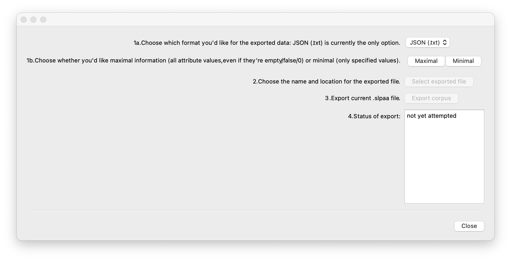

.. _manage_corpus:

*****************
Managing a corpus
*****************


.. _add_signs:

Adding signs to an existing corpus
``````````````````````````````````
To add new signs to an existing corpus, go to "File" and select "Load corpus...". This allows you to search your
computer. Only files with the extension ".slpaa" are available for selection. Click on a corpus that you would like to
work on, and click "Open".

To add a sign, click on the green 'plus' sign in the upper left corner, go to "File" / "New sign," or use the keyboard shortcut Ctrl-N (Windows) or Cmd-N (Mac). The :ref:`sign_level_info` box will open; at least one of the 'gloss,' 'lemma,' or 'ID-gloss' fields must be filled in. Once the desired information is added, clicking "Save" will close that box and create an entry for the sign in the corpus list. If the setting for x-slots is set to 'None,' then modules can now be added. If the setting for x-slots is set to 'Manual,' then the number of x-slots must first be specified before any modules can be added. The x-slot setting is available through the :ref:`setting_preferences` menu. A general description of the x-slot functionality is available throguh :ref:`timing`.


.. _delete_signs:

Deleting a sign
`````````````````
To delete one or more signs from a corpus, click on the sign (or multi-click on multiple signs) in the "Corpus" and then click on the red 'x' sign in the upper left corner, go to "File" / "Delete," or right-click (ctrl-click on a Mac) on the sign in the corpus and select "Delete sign(s)." Note that while you will be asked to confirm deletion, a deleted sign cannot be recovered once the corpus is saved after deletion.


.. _new_corpus:

Switching to another corpus
```````````````````````````
If you once started transcribing signs in one corpus but would like to switch to another corpus and continue on transcribing
your next sign, go to Menu and select "New corpus". This function refreshes the program, and you will see that there is no 
sign listed in the "Corpus" column on the right. You can then load another corpus (see :ref:`load_corpus`).


.. _save_corpus:

Duplicating a corpus
````````````````````
To duplicate a corpus and save it with a different file name, go to "Menu" and select "Save as...". A new window opens, 
titled "Save Corpus". 


Type in a file name for your new corpus, specify a saving location, and click "Save".


.. _export_corpus:

Exporting a corpus (beta)
``````````````````
If just working within SLP-AA, the regular saving of a corpus as an .slpaa file is all that is needed; these files can be re-opened within the software. However, it may be useful to have a more text-readable version of the corpus, so we currently have preliminary ability to export a corpus as a .json file. Note that currently (March 2025), these files cannot yet be re-imported into SLP-AA; they are simply for use outside of the program. 

To export a corpus, go to "File" and select "Export corpus..." A new window will appear:



Follow the prompts to select whether the export should be 'maximal' (i.e., include every line of text for each sign, even if those lines are not used / 'unspecified') or 'minimal' (i.e., only include specified values for each sign), set the export location, and complete the export. 


