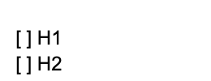
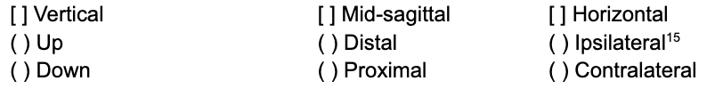
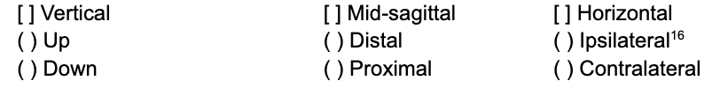

.. _orientation_module:

**************************
Orientation Module
**************************

This optional module codes absolute orientation. **add about options for conventions on coding orientation)** (include link to section of global settings documentation). The absolute orientation of the hand is described in two ways, firstly you will select the palm direction and then the finger root direction. These terms will be further explained below in their respective sections. Both palm direction and finger root direction must be coded for a full and accurate coding of absolute orientation.

If absolute orientation is being coded, there must be a module for each hand in the sign (i.e., a two handed sign would have at least two orientation modules and and a one-handed sign would have at least one orientation module). 

Note that directions on the horizontal axis can be set to either be absolute (right / left) or relative (ipsilateral / contralateral). The default is to use relative directions, but this can be changed in the :ref:`global_settings`.

The selection options included in this module are outlined below:

**1) This module applies to**
  

        
**2) Palm direction**

      
      
Palm direction refers to the direction that the friction surface of the hand (minus the fingers) is facing. When selecting palm direction, you are         able to maximally select one option from each set of options (e.g., **give an example of a sign and how it would be coded.**)
     
**3) Finger root direction**

        
Finger root direction refers to the direction that the fingertips would be pointing if they were to be fully extended. You can maximally select one         from each set of options, that is, you may combine two or more columns if more than one of the direction options is involved (e.g., **give an example of a sign and how it would be coded.**)
        
        
        
**give an example of how the whole orientation module would look for a certain sign. INCLUDE IMAGE?**

     
