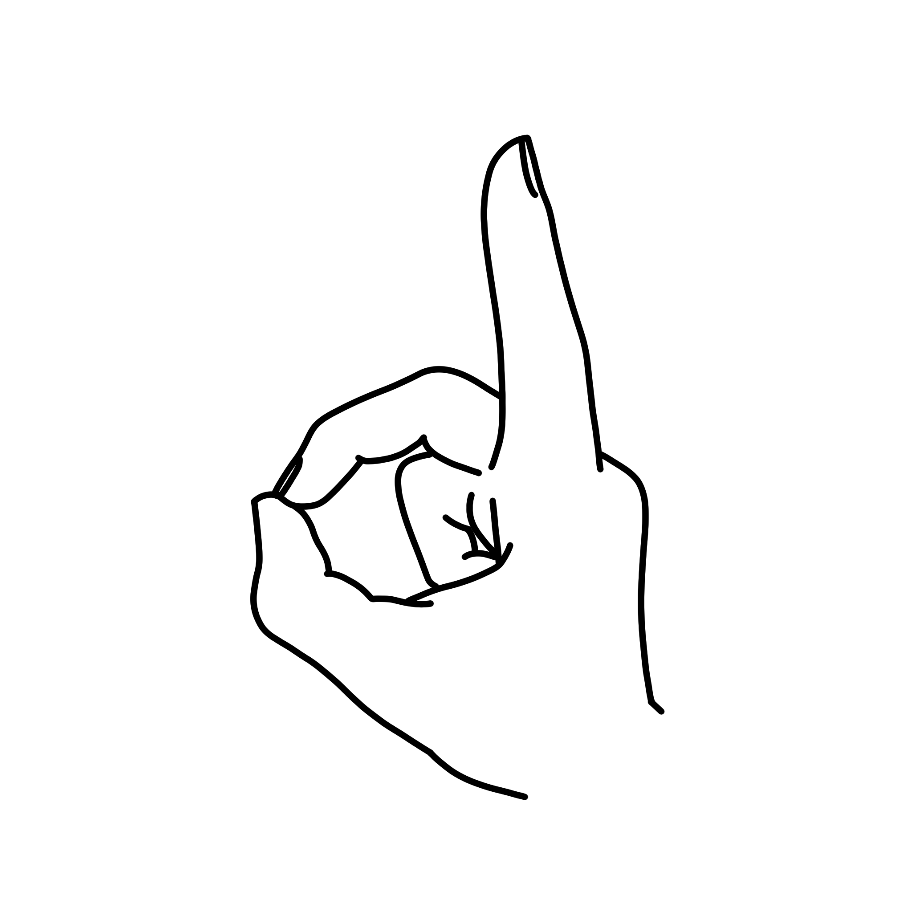
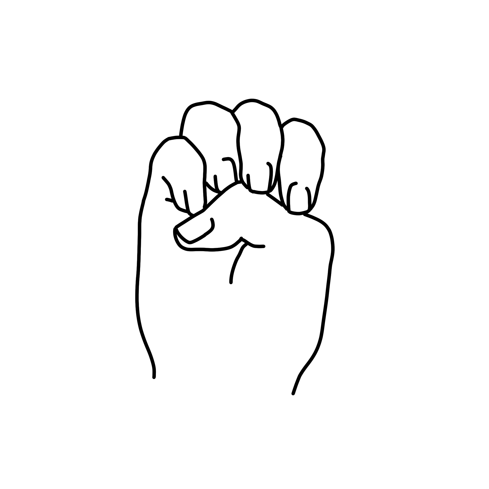
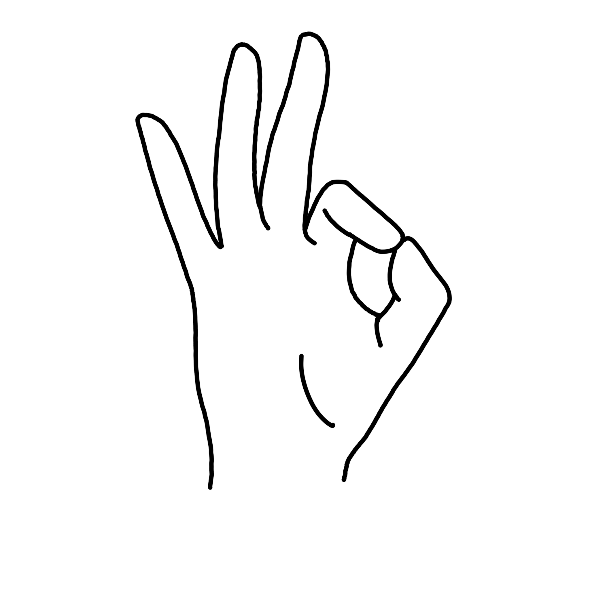
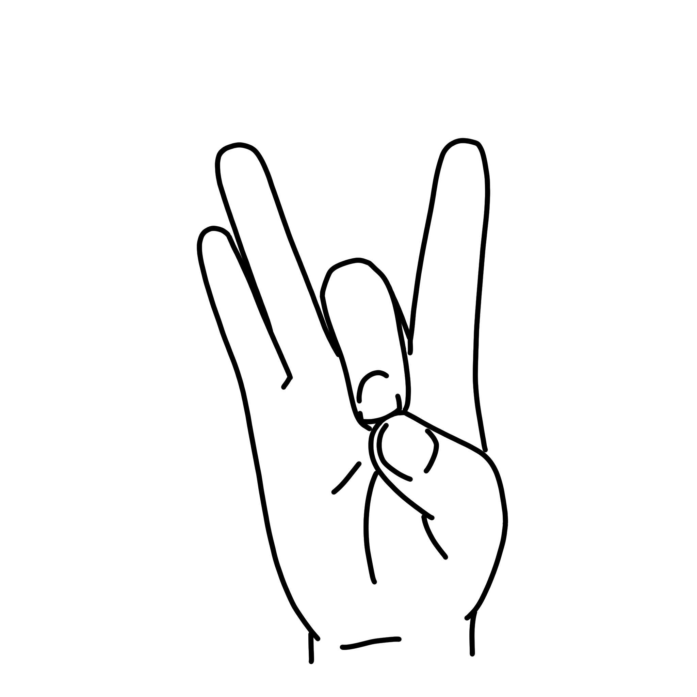
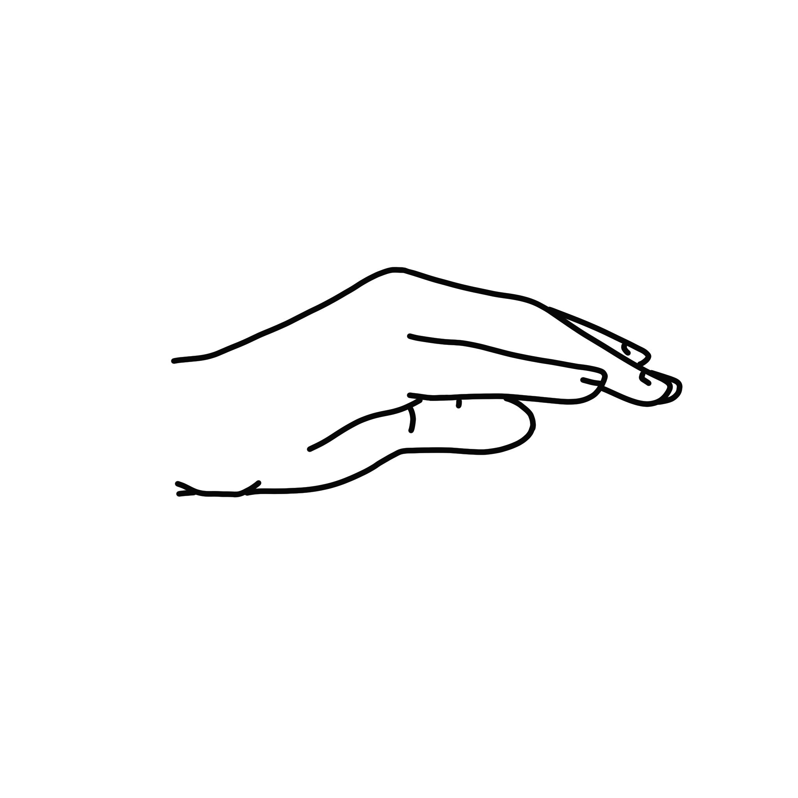
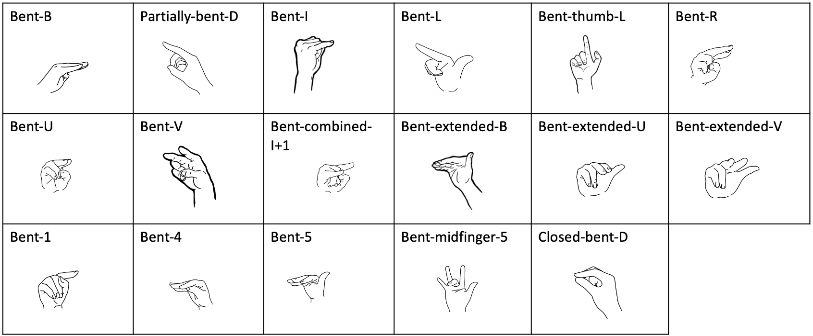
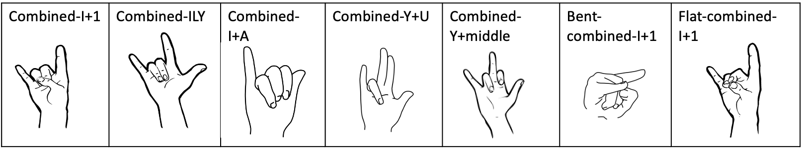

.. _predefined_handshapes:


*********************
Predefined Handshapes
*********************

While it is always possible to manually specify each component of the hand configuration, sometimes it is more efficient to use or start with handshapes that are pre-specified. To that end, we have included a set of 132 handshapes that have already been coded using the Johnson & Liddell SLP system ([Johnson2011b]_, [Johnson2012]_), which we refer to as "predefined handshapes." This section describes how to use these handshapes in the software and the conventions we used when coding them, and includes a list of all the handshapes included. The handshapes were selected by (1) using the handshapes available and created by `CSLDS, CUHK <http://www.cslds.org/v4/resources.php?id=1>`_ and (2) the set of handshapes included in the Canadian Dictionary of ASL [CDASL]_). We make no specific claims about the 'completeness' of this inventory for covering handshapes that are found in the world's sign languages; these were simply the set most readily available to us and most relevant for our own research projects. We gratefully acknowledge the work of Cristina Lee in drawing the images used for the handshapes that are not made from the CUHK font map.

.. _select_handshape:

1. Selecting a Predefined Handshape
```````````````````````````````````
To select a predefined handshape, you first need to be in the :ref:`hand_configuration_module` dialogue box. Click on the "Load predefined handshape" button. A new window will open. The predefined handshapes are organized vertically by base handshape and horizontally by modification type. For example, if you are searching for 'clawed-F', you can find it in the 'F' row and the 'clawed' column (see :ref:`handshape_images`).

Once you have selected a predefined handshape, the transcription will be filled in to the slots of the appropriate configuration and hand on the 'hand configuration selection' window. The name and image of the selected handshape will appear to the right of the slots. To change the selection, you can simply select another predefined handshape to replace it. Once the right shape has been selected, the predefined handshape selection window can simply be closed; there is no separate step of 'saving' the handshape. To clear this selection, click on the 'clear' button to the right of the predefined handshape name.


.. _make_changes:

2. Making Specific Changes
``````````````````````````
Once a predefined handshape has been selected, you can change individual slots of the transcription by clicking on a slot and either selecting an option from the dropdown menu or typing in the appropriate symbol. Once changes are made, the name and image of the predefined handshape will no longer appear to the right of the transcription, unless the new transcription happens to be an exact match for a different predefined handshape. (For more detailed explanation of the transcription process, see :ref:`transcription_process.rst`).


.. _handshape_conventions:

3. Conventions for How Predefined Handshapes were Coded
```````````````````````````````````````````````````````

The transcription system for the predefined handshapes is based on the system outlined by Johnson & Lidell (2011, 2012). Specific changes to this system were made for the predefined handshapes used in SLPAA. The conventions are organized in three main parts: :ref:`general_conventions`; :ref:`baseline_handshapes` (i.e., information about the basic handshapes, such as the 'A' handshape); and :ref:`derived_handshapes` (i.e., information about handshapes that are variations derived from the basic handshapes, such as the 'extended A' handshape). 


.. _general_conventions: 

I. General Conventions
======================

This section describes the general conventions that were used when coding the handshapes. These general conventions are organized in two groups: a) conventions regarding the labels and images of the predefined handshapes, and b) conventions regarding the transcriptions of the predefined handshapes. 


a) Labels and Images of Handshapes:
~~~~~~~~~~~~~~~~~~~~~~~~~~~~~~~~~~~

- Naming of handshapes
    - Names for handshapes typically follow the names given by *The Canadian Dictionary of ASL* [CDASL]_. In some cases, there are other possible names for a given handshape that we did not use, even if they were more concise (e.g. the handshape "bent-extended-V" could have alternatively been labeled "bent-3"). If you are looking for a particular handshape, consider whether it could be described in an alternative manner.
    
- Conventions used for labels where multiple derivations from the baseline are involved:
    - Handshapes are sorted based on the first listed derivation in the label.
    - The following order was generally followed for consistency: (1) derivations involving the fingers (flexion, adduction); (2) derivation involving thumb, “combined”, base(s), “index”] 
    - “Offset” is considered a derivation involving the thumb
    - The derivations called “modified”, “closed” and “open” are positioned fitting to the order in which they apply to the base relative to the other derivation. For example: for “spread-open-O,” the modification “open” applies before the modification “spread”.
    
- Labels for combined handshapes 
    - All combined handshapes that have been coded involve at least one of either “I” or “Y” and have therefore been listed under one of those baseline handshapes as opposed to any other handshape they may be combined with. 

- Relation between pictures of handshapes and transcription
    - For baseline handshapes, pictures and transcriptions should be an exact match.
    - For derived handshapes, the transcriptions will match the conventions below (see :ref:`derived_handshapes`), even if that means the picture is not an exact match. For example, the convention for thumb abduction for all “extended” handshapes is to have it be fully abducted ({). However, the image for “clawed-extended-L” shows a laterally positioned (L) thumb that is *not* fully abducted. The image shows what would have been transcribed as a neutral (<) abduction value, but the transcription uses { as the conventions dictate. This discrepancy between images and transcriptions is simply an artifact of the images we had available.


b) Transcription of Handshapes:
~~~~~~~~~~~~~~~~~~~~~~~~~~~~~~~
- Relationships among baseline and derived handshapes

    - We attempted to keep things maximally consistent in two ways: first, consistency between a baseline handshape and its derivations, and second, consistency among all derivations of the same type across different baselines. 
        - For example, the 'extended' derivation involves the thumb being coded as [L] (lateral) and [E-E] (both joints extended). So, for "extended-A," the handshape should be identical to the baseline handshape for "A" except for those three specific characteristics. And, all 'extended' handshapes should share those three characteristics with each other. Specific exceptions to this principle are noted in the descriptions below (see e.g. 'A-index'); these exceptions are listed under both the baseline handshapes (e.g. "A") and the relevant derivation (e.g. "index").

- Using only F, E, i (not f, e)
    - [F] was used for a fully bent joint, [i] was used to achieve a slightly bent joint, and [E] was used for a straight extended joint. [f] and [e] were avoided because of the vagueness involved in their interpretation. 
    - [i-i-i] was used when the finger was meant to look rounded (e.g., in the “O” handshape)

- Finger tuckedness 
    - For consistency within a particular handshape group (a baseline handshape and its derivations), a somewhat arbitrary decision was made for certain handshapes that have multiple documented possibilities for finger tuckedness. For example, the 'L' handshape could be produced with the non-selected fingers (fingers 2 (middle), 3 (ring), and 4 (pinkie)) 'tucked under' and fully flexed (their flexion would be coded as F-F-F), or with those fingers in a fist shape but with the distal joints 'untucked' (which would be coded as F-F-E). 
    - In some cases, this decision was based on the available images of the handshape.
    - Note that we plan that searches for these handshapes may include finger flexion values of F-F-F and F-F-E for a broader range of instances of the handshape, or be narrowed down to one or the other for more specific instances of a particular configuration.
    - Note the exception of baseline “A” and “modified-A”, whose only distinction is the tuckedness of the fingers.

- Variations of Y-derived handshapes
    - For consistency with baseline “Y”, which is coded with a neutral abduction (<) of finger 4, Y-derived handshapes (e.g., combined-ILY & combined-Y+U) maintain this abduction value for finger 4. However, variations exist with an adducted, or ‘upright’ (=), finger 4 or with a fully abducted ({) finger 4 (in the case of combined-ILY, both fingers 1 & 4 adducted (=) or fully abducted ({))

- Criteria for adduction
    - The criteria for full adduction (=) are slightly different for fingers 1-3 as compared to finger 4, with that of finger 4 being less strict. 
    - For fingers 1-3, they are coded as adducted (=) if they are touching or if they are slightly apart but still parallel. 
    - For finger 4, it is coded as adducted (=) if it is touching the side of finger 3 or if the space between finger 3 & 4 at the distal bone of finger 4 is equal to or smaller than the width of the distal bone of finger 4. 

- Adduction/abduction of bent handshapes 
    - For certain handshapes with extended fingers (e.g. “L”, "V" & "U") that are coded with neutral abduction (<) between the extended (E) finger(s) and flexed (F) fingers, their “bent” counterparts (i.e. "bent-L", "bent-V" & "bent-U") are coded with full adduction (=) between these same fingers due to all proximal joints being flexed (F). 


`````````````````````````


.. _baseline_handshapes:

II. Baseline Handshapes
=======================

This section provides an overall list of all the baseline handshapes. If relevant, a baseline handshape may have one or more bullet points describing handshapes derived from that base which may require special notes in addition to the overall descriptions in section :ref:`derived_handshapes`. All "modified" handshapes are described in the current section. For images of specific derived handshapes, see :ref:`derived_handshapes`. For images of all handshapes together, see :ref:`handshape_images`. The base handshapes are listed along the leftmost column of the grid. 

        
A
~   

|
|
|
- In “modified-A”  the fingers are extended down to touch the palm (rather than tucked as for baseline “A”).
- “A-index” differs from the baseline “A” handshape in that the index finger is raised and curved rather than tucked, and the thumb has a neutral abduction (<) rather than full adduction (=). In this case, the handshape does not follow the description of the ‘index’ derivation.
|

B   
~    


|
|
|     
- “B1” has the thumb crossed in front of the palm, while “B2” has the thumb adjacent to the index finger.
|
C
~

|
|
|
D
~

|
|
|
- “Modified-D” has fingers 2, 3 & 4 creating the body of the D (as opposed to baseline “D”, which makes the body of the D using only the middle finger and tucks fingers 3 & 4 against palm). 
|
E
~

|
|
|
F
~

|
|
|
G
~

|
|
|
|
|
- “Modified-G” has the thumb extended parallel to the index finger (rather than the thumb sticking up at roughly a 90 degree angle from the index finger as in baseline “G”).

K
~

|
|
|
L 
~


   
|
|
|
|
- “Bent-thumb-L” has i for proximal joint and F for distal joint of thumb, but finger 1 is extended as in baseline “L”. This differs from “bent-L” which has finger 1 bent and the thumb extended. 
    
M
~

|
|
|
N
~

|
|
|
O 
~

|
|
|
- “Modified-O” appears to be a slightly flattened shape compared to baseline “O”, which has all joints of all fingers and thumb curved. In “modified-O”, the fingers are still curved at the medial and distal joints, with the proximal joint flexed (F). The thumb is extended forward from the palm in an opposed position (O) with no joints curved. This handshape is used in the ASL sign TEACH.

R
~

|
|
|
|
|
S 
~

|
|
|
T
~

|
|
|
|
- “Covered-T” has the medial joint of the index finger contacting the tip of the thumb, curving over the tip and covering the thumb. This differs from the description of "covered" which generally describes the friction distal part of the thumb touching the back distal part of the selected finger(s).
|
U 
~

|
|
|
|
- “Contracted-U-index” has the index finger in a half-folded position beside a fully extended middle finger. In this case, the index finger does not follow the [i-E-E] pattern of the other “contracted” handshapes.
|
V
~

|
|
|
|
|
W
~

|
|
|
|
|
X
~

|
|
|
|
|
Y
~

|
|
|
|
|
- “Modified-Y”  was not included in the predefined handshapes. Although this handshape occurs in *The Canadian Dictionary of ASL*, there are only three entries of signs that use it and there is no consistency between the depictions of the handshape. 
|

1
~

|
|
|
3
~
.. image:: images/pdhs_3.png
        :width: 60
        :align: left
|
|
|
|
|
4
~

|
|
|
|
|
5
~

|
|
|
- “Modified-5” has the thumb extended forward from the palm in an opposed position (O), as opposed to baseline 5, which has the thumb extended away from the side of the palm (L)

8
~

|
|
|

Middle Finger
~~~~~~~~~~~~~

|
|
|
|
|

Standard Base
~~~~~~~~~~~~~

        
|
|
|
|
- This handshape occurs in *The Canadian Dictionary of ASL*. 
- All fingers are adducted (=) and have proximal joints slightly bent (i), and medial and distal joints extended (E). Thumb is unopposed (U) and has neutral abduction (<). 


`````````````````````````````````````````


.. _derived_handshapes:

III. Derived Handshapes
=======================

This section provides a complete list of the derivations which modify the base handshapes. The derivations are listed in alphabetical order. Under each heading, there are four descriptions: 1) Dictionary description, explaining the derivation as it is described in the *Canadian Dictionary of ASL* [CDASL]_; 2) Generic description, which outlines the derivation using general language; 3) SLP coding description, which describes the derivation through the specific terms used in the transcription of the handshapes; and 4) Prototypical coding, which provides (if applicable) an example of the typical coding of particular aspects of the handshape that are associated with the derivation.

For images of all derived handshapes see :ref:`handshape_images`.


Adducted
~~~~~~~~
- **Dictionary description:** N/A
- **Generic description:** Fingers are adducted
- **SLP coding description:** full adduction between each finger
- **Prototypical coding:** [=] between each adducted finger


|
|
|
|
|
|
     

Bent
~~~~
- **Dictionary description:** "Handshape is compressed to take on a flat appearance"
- **Generic description:** Selected fingers are extended straight from the palm with only the bottom joint flexed (except “bent-thumb-L”, which has the thumb lateral and bent upwards parallel to the extended index finger) 
- **SLP coding description:** proximal joint of each bent finger is F; other joints are often E but may depend on handshape (except for “bent-thumb-L” -- see description under baseline "L" above)
- **Prototypical coding:** F-E-E on each bent finger


        
|
|
|
|
|
|
|
|
|
|

Clawed
~~~~~~
- **Dictionary description:** "Handshape with fingers rigidly retracted to resemble the talons on a bird of prey"
- **Generic description:** Selected fingers are extended from palm, with top two joints flexed
- **SLP coding description:** proximal joint of each clawed finger is E and the medial and distal joints are F and i respectively. Thumb flexion is i-F. Thumb is not flexed when a) the handshape is described as "extended" or b) thumb already has contact to another bone, for example: “clawed-4'', “clawed-F”, and “clawed-W”. 
- **Prototypical coding:** E-F-i on each clawed finger and i-F on thumb 


     
        
|
|
|
|
|
|
|
|
|
|
|

Closed
~~~~~~
- **Dictionary description:** "A tighter handshape"
- **Generic description:** Closed may refer to decreased abduction between fingers and/or thumb compared to the base handshape, including complete adduction and contact.
- **SLP coding description:** Coding dependent on baseline handshape. For example: baseline “W”  to “closed-W” involves abduction values between fingers 1 & 2 and 2 & 3 to change from { to =, whereas baseline “X” to “closed-X” involves a change in thumb-finger contact but the finger positions are not modified. 
- **Prototypical coding:** N/A


     
        
|
|
|
|
|
|
|
|

Combined
~~~~~~~~
- **Dictionary description:** "Putting two shapes together"
- **Generic description:** Handshape results from combining two existing base handshapes into one
- **SLP coding description:** Most prominent features of two handshapes are combined into one handshape (example “combined-ILY” handshape). No consistency due to variations in which handshapes are being combined. 
- **Prototypical coding:** N/A


     
        
|
|
|
|
|
|
|
|

Contracted
~~~~~~~~~~
- **Dictionary description:** “The fingers contract as the description suggests, but the fingers involved remain straight”
- **Generic description:** Selected fingers are extended from palm, with bottom joint curved. If the thumb is not in contact with any fingers, it will be extended forward from the palm in an opposed position (e.g., “contracted-C”). If the thumb is in contact with fingers that are contracted, it maintains contact and otherwise follows the preceding description for the thumb (this happens only in “contracted-B”). If the thumb is in contact with fingers that are not themselves contracted, the thumb is not affected (this happens only in  “contracted-U” and “contracted-U-index”). 
- **SLP coding description:** For each contracted finger, the proximal joint is i. The thumb is E-E, opposed (O), and maximally abducted (except if thumb has contact with another bone, as in “contracted-B”, “contracted-U” & “contracted-U-index”) 
- **Prototypical coding:** i-E-E for each contracted finger and E-E for thumb. Thumb opposed (O) and maximally abducted ({), except for “contracted-B”, “contracted-U” & “contracted-U-index”.


     
        
|
|
|
|
|
|
|
|
|
|
|


Covered
~~~~~~~
- **Dictionary description:** "Fingers overlap slightly"
- **Generic description:** Thumb and selected fingers make contact and overlap 
- **SLP coding description:** Thumb is opposed, and distal joint of thumb makes contact with selected finger(s) (except for “covered-T” -- see description under baseline "T" above) 
- **Prototypical coding:** Thumb/finger contact (typically friction distal part of thumb touching back distal part of fingers)


     
        
|
|
|
|
|
|
|
|

Crooked
~~~~~~~
- **Dictionary description:** "Fingers are slightly retracted in a relaxed way"
- **Generic description:** Selected finger(s) are extended from the palm, with the bottom joint extended and the top two joints curved
- **SLP coding description:** For selected fingers, the proximal joint is E, medial and distal joints are i
- **Prototypical coding:** [E-i-i] for each crooked finger


     
        
|
|
|
|
|
|
|
|
|
|
|


Extended
~~~~~~~~
- **Dictionary description:** "Thumb moves out to the side"
- **Generic description:** The thumb sticks straight out to the side from the hand
- **SLP coding description:** The thumb is lateral and extended, with no finger contact
- **Prototypical coding:** Thumb is L and thumb is E-E


     
        
|
|
|
|
|
|
|
|
|
|
|


Flat
~~~~~~
- **Dictionary description:** "Hands are compressed to take on a flat appearance"
- **Generic description:** Handshape appears flattened
- **SLP coding description:** Proximal joint is bent to make the handshape appear flattened
- **Prototypical coding:** Usually F at the proximal joint, and E at the medial and distal joints [F-E-E] for each selected finger and thumb is generally E-E (except for “flat-M”)


     
        
|
|
|
|
|
|
|
|


Index
~~~~~~
- **Dictionary description:** "Involves only the thumb and forefinger (as opposed to the entire hand)"
- **Generic description:** Handshape is made by using only the thumb and index finger (middle, ring and pinky fingers usually tucked away)
- **SLP coding description:** Finger 1 is selected 
- **Prototypical coding:** Generally follows the transcription of its base handshape but selecting only finger 1 (or fingers 1&2 in the case of “double-C-index”), and remaining fingers are often [F-F-F] (exceptions: see above for descriptions of “A-index” and “contracted-U-index”)


     
        
|
|
|
|
|
|
|
|

Modified
~~~~~~~~
- **Dictionary description:** “Has a slightly different look about it”
- **Generic description:** Every modified handshape is different based on the type of modification it has
- **SLP coding description:**  See specific descriptions above under the baseline handshape header.
- **Prototypical coding:** N/A

.. image:: images/pdhs_modified.png
        :width: 350
        :align: left
     
        
|
|
|
|
|
|
|
|
|
|
|

Offset
~~~~~~
- **Dictionary description:** "Thumb moves just a little to the side of where it normally is for that handshape"
- **Generic description:** The thumb is extended straight from the palm and the bottom joint makes contact with the first finger 
- **SLP coding description:** The proximal and medial joint of the thumb is extended, and the proximal joint of the thumb makes contact with the radial surface of the finger it contacts.
- **Prototypical coding:** E-E for thumb


     
        
|
|
|
|
|
|
|
|

Open
~~~~~~
- **Dictionary description:** "A less tucked handshape"
- **Generic description:** Selected fingers less tucked and have no contact with the thumb.
- **SLP coding description:** Selected fingers are distanced from their point of contact on thumb (e.g. "open-E", “open-F”, “open-O”). The overall handshape may be ‘looser’ and fingers less flexed (e.g.“open-A”). 
- **Prototypical coding:** No contact between thumb & fingers. Joints that are fully flexed [F] in the baseline handshape have [i] in the "open" handshape. 


     
        
|
|
|
|
|
|
|
|


Relaxed
~~~~~~~
- **Dictionary description:** N/A
- **Generic description:** In a relaxed handshape, the main distinction is that the fingers are not tensed and are primarily influenced by gravity. “Relaxed-contracted-5'' is currently the only handshape with this description. 
- **SLP coding description:** “relaxed-contracted-5” differs from “contracted-5” in that the fingers are not tensed and their position is primarily influenced by gravity. The fingers are not forcefully curved, but this handshape is transcribed with medial joints curved (i) to systematically distinguish the transcription from “contracted-5,” where medial joints are extended (E), as in the description of "contracted". 
- **Prototypical coding:** i-i-E for extended fingers


     
        
|
|
|
|
|
|
|
|
|
|
|
Slanted
~~~~~~~
- **Dictionary description:** "A slightly askew handshape"
- **Generic description:** Selected fingers are slanted from its baseline handshape, with the bottom joints of each finger becoming more flexed as you move from the first finger to the fourth finger
- **SLP coding description:** The fingers become progressively more flexed as you move towards finger 4. The proximal, medial, and distal joint for the first finger is extended, except for “slanted-F” (because the index finger has contact with the thumb) and “slanted-V” (because the index finger is slightly bent).
- **Prototypical coding:** typically E-E-E for the first finger, then typically i-E-E for finger 2, i-E-E for finger 3, and F-F-E for finger 4. Note: since the flexion value i represents a range of flexion, for slanted handshapes that have two adjacent fingers both coded with i-E-E, it is understood that the finger farther from the thumb is slightly more flexed.


     
        
|
|
|
|
|
|
|
|
|

Spread
~~~~~~
- **Dictionary description:** "Fingers spread to create space between them"
- **Generic description:** Selected fingers are spread from each other
- **SLP coding description:** Fingers 1-4 are abducted
- **Prototypical coding:** { between each pair of fingers


     
        
|
|
|
|
|
|
|
|
|


````````````````````````````````````````````


.. _handshape_images: 


4. Images of the Predefined Handshapes
```````````````````````````````````````
The predefined handshapes are organized in a grid where the rows are organized by base handshape and the columns are organized by derivation type. In other words, each row starts on the left with the base handshape and continues to the right with the derived versions of that base handshape organized under their appropriate column. Both the rows and the columns are organized alphabetically. [updated]

   
   .. image:: images/pdhs_all_handshapes.png
      :width: 900
      :align: center
     


