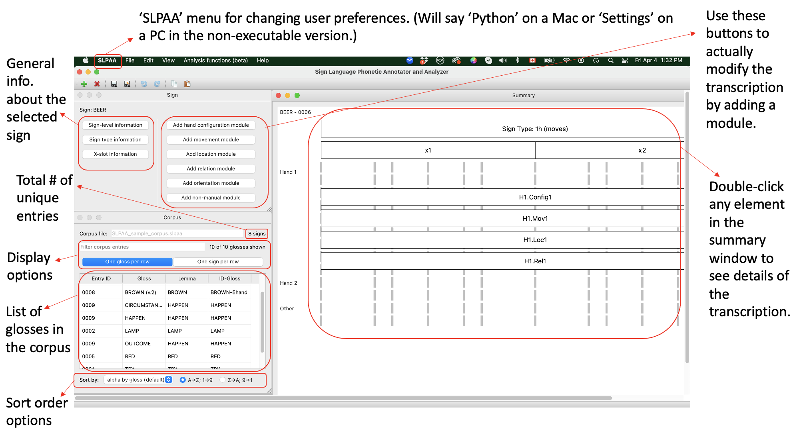

.. _sample_corpus:

************************
About the Sample Corpus
************************

.. todo::
   - migrate the information about sign identifiers to its own section and cross-reference
   - migrate the references to the master references section
   - add cross-references to the various documentation parts about specific modules (e.g. the movement module when referred to in the description of a particular entry)

.. _background_sample_corpus:

1. Background on the Sample Corpus
```````````````````````````````````
The sample corpus is provided as a means of helping new users orient themselves to the software. It is not intended to be a perfect transcription of the signs in question. Note in particular that there are often different particular conventions that could be used to transcribe a single sign in different ways (and at different levels of phonetic or phonological detail), so please don’t interpret the choices we made here as definitively ‘correct’ choices. Instead, they were made to illustrate various possible ways of interacting with the software.

**Suggestions for navigating the sample corpus:**
 
* Open the software and select “Load sample,” either from the initial pop-up window that appears when starting the software or by going to File / Load sample
* Go to Python / Preferences (on a Mac) or Settings / Preferences (on a PC) and go to the “Sign” tab. Change “x-slot generation” from “None” to “Manual” to allow the specific timing characteristics of signs to be visible. Click “Save.” (This will now be your default for all corpora until you change it again manually.)
* Look at the signs in the sample corpus and compare them to their original source forms. The signs are listed below in a suggested order of perusal with some of their key characteristics. Double-clicking on any of the modules in the summary window will open up the details of the transcription.

**Overview of the SLP-AA interface with the sample corpus loaded:**



.. _identifiers_sample_corpus:

2. Sign Identifiers
```````````````````````````````````
Before delving into the specific sample entries, it's worth going over some definitions of sign-identifiers. There are four ‘identifiers’ for each entry:

1. the entry ID
  * essentially numeric
  * auto-generated by SLP-AA
  * automatically is unique for each entry in the corpus and should not ever change
  * only one per entry
  * the user can choose the displayed format of the number (under ‘Preferences / Entry ID’), but can't change the actual content
 
2. the ID-gloss
  * similar to a text version of the entry ID
  * there is only one per entry
  * the user generates it, but is never allowed to duplicate an existing ID-gloss, so each ID-gloss is unique in the corpus
  * should generally reflect both the meaning and the form simultaneously (see discussion below of the signs BROWN (v. 1) , BROWN (v. 2), HAPPEN, OUTCOME, and CIRCUMSTANCE in the sample corpus)
 
3. the gloss(es)
  * a basic explanation of the meaning of an entry
  * unlike the ID-gloss, there can be multiple glosses for a single entry, allowing for semantic variation in the way a single form is used (see examples for the ID-gloss HAPPEN in the sample corpus)
  * the user generates them, and there is no 'check' by SLP-AA on the format of the glosses
  * each gloss results in a separate line in the corpus window view, but these are all linked back to the same single entry
 
4. the lemma
  * a statement of the meaning of an entry
  * there is only one per entry, but there can be multiple entries with the same lemma (these are expected to have different forms; this captures lexical variation; see example for the lemma brown in the sample corpus)
  * the user generates them

To summarize the distinct use of gloss, ID-gloss, and lemma:

  * **homophones** like BROWN (v. 1) and BEER have different entries that coincidentally contain the same phonological transcription; they have different entry IDs, ID-glosses, glosses, and lemmas
  * **lexical variants** like BROWN (v. 1) and BROWN (v. 2) have different entries because they have different phonological transcriptions; they have different entry IDs, ID-glosses, and glosses, but share the same lemma
  * **semantic variants** like HAPPEN, CIRCUMSTANCE, and OUTCOME are all under a single entry, because they are phonologically identical and the difference is just in the English gloss; all three glosses are associated with the same entry, which has one entry ID, one ID-gloss, and one lemma


.. _entries_sample_corpus:

3. Entries in the Sample Corpus
```````````````````````````````````

LAMP
  * based on `LAMP <https://asl-lex.org/visualization/?sign=lamp>`_  
  * note the change in hand configuration from beginning to the end of the sign
  * note the use of a purely spatial signing space location, high in the vertical space
  * note the use of a single non-manual module to simultaneously encode the head, mouth, and eye characteristics, which all have the same timing

TRY
  * based on `TRY <https://www.youtube.com/watch?v=Hr11yePqoek>`_  
  * note the use of two separate (but simultaneous) movement modules, one for the arc movement (a ‘perceptual shape’) and one for the pronation (a ‘joint-specific movement’)
  * note the use of a body-anchored signing space location
  * note the use of the relation modules to indicate the change in distance between the hands and the torso from the beginning to the end of the sign
  * note that all manual modules apply simultaneously to both hands (there’s only one ‘instance’ of each module, even though it appears twice in the summary window)

RED
  * based on the following sign from the *Canadian Dictionary of ASL* (Bailey & Dolby 2002):

  .. image:: images/RED_CD-ASL_entry.png
      :width: 750
      :align: left

  * note the use of the relation module to code the contact between the finger and the lip, including which part of the finger makes contact using the “specify hand parts” option (click on “Finger 1” to see the sub-menus for the specific part of Finger 1 that is used)
  * note the specification of the ‘downward angle’ in the movement module as being both ‘vertical / down’ and ‘sagittal / distal’
  * note the use of ‘additional movement characteristics’ in the movement module to code the concept of ‘very firmly forward’ as ‘force / strong’


UNDERSTAND
 * based on the following sign from the *Canadian Dictionary of ASL* (Bailey & Dolby 2002):

  .. image:: images/UNDERSTAND_CD-ASL_entry.png
      :width: 750
      :align: left

 * note the use of the relation module to specify the hand parts and proximity of the right hand to the location on the forehead
 * note the use of ‘additional movement characteristics’ to code the concept of ‘flicking’ as ‘speed / fast’


BEER
  * based on `BEER <https://www.handspeak.com/word/2837/>`_ 
  * note the presence of 2 x-slots to indicate the two separate movements
  * but also note the fact that the modules span both x-slots
  * note the movement module in particular as encoding the presence of repetition, with exactly two cycles


BROWN (v. 1)
  * based on the *second* video at `BROWN <https://www.handspeak.com/word/265/>`_ 
  * note that there are two entries in the corpus for the concept ‘the colour brown’; this one is glossed as “BROWN (v. 1)” but both have the same lemma, BROWN, because they refer to exactly the same concept
  * this one has a form that is identical to beer, except for the non-manual components, which aren’t coded here (to highlight their ‘homophony’)
  * despite being homophonous, they are given separate entries in the corpus, because they mean different things
  * editing one will have no effect on the transcription of the other


BROWN (v. 2)
  * based on the *first* video at `BROWN <https://www.handspeak.com/word/265/>`_
  * this is the second version of the concept 'brown' in the corpus; it is glossed as BROWN (v. 2) but given the same lemma as BROWN (v. 1), i.e., BROWN
  * note that the two versions of brown are also given different ‘ID-glosses’ (BROWN-Bhand and BROWN-5hand) because they correspond to unique forms with separate entries in the corpus
  * in this case, the glosses were already unique (with separate version numbers), but compare this case to the various signs with the single ID-gloss HAPPEN below


HAPPEN
  * based on `HAPPEN <https://asl-lex.org/visualization/?sign=happen>`_ 
  * note the use of a single non-manual module to transcribe both the dynamic head nod and the static lip gesture, because they are simultaneous
  * see CIRCUMSTANCE, OUTCOME below
 
CIRCUMSTANCE, OUTCOME
  * based on `HAPPEN <https://asl-lex.org/visualization/?sign=happen>`_ 
  * these are simply other English glosses that are associated with the exact same sign as HAPPEN
  * these are actually listed as separate glosses in the ‘sign-level information’ for this entry (accessed by clicking on ‘Sign-level information’ in the ‘Sign’ window, or by double-clicking the entry in the ‘Corpus’ window)
  * note that they all have the same lemma, the same ID-gloss, and the same entry ID, because they really are all just pointers to the same entry
  * so, note that in the case of the two versions of BROWN, the entries are separate because they have different forms, and the glosses and ID-glosses are both unique
  * but in the case of HAPPEN, CIRCUMSTANCE, and OUTCOME, it’s a single entry with multiple unique glosses and yet a single ID-gloss (used to uniquely identify the form of the entry)
  * editing the transcription of any of them will change the transcription of the others (because there aren’t actually separate entries)
  * in the ‘Corpus’ window, note that the distinction between entries and glosses is noticeable by the existence of 8 signs (8 entries, each with a unique transcription), but 10 glosses shown (because the entry for HAPPEN is shown three times, once for each of its three glosses)
  * the lines shown can be filtered by typing into the text box (all entries with text that is matched in any of the gloss, lemma, or ID-gloss will be shown)
  * the lines shown can also be sorted by different criteria using the selection box at the bottom of the window; this can help highlight how entries share or don’t share various information

.. _references_sample_corpus:

4. References
`````````````

* Bailey, Carole Sue, and Kathy Dolby (eds.). (2002). The Canadian Dictionary of ASL. Edmonton: The University of Alberta Press.
* Lapiak, J. (1995-2024). Handspeak®. `https://www.handspeak.com/ <https://www.handspeak.com/>`_
* Sevcikova Sehyr, Z., Caselli, N., Cohen-Goldberg, A. M., & Emmorey, K. (2021). ​The ASL-LEX 2.0 Project: A database of lexical and phonological properties for 2,723 signs in American Sign Language. Journal of Deaf Studies and Deaf Education. `https://doi.org/10.1093/deafed/enaa038 <https://doi.org/10.1093/deafed/enaa038/>`_   

