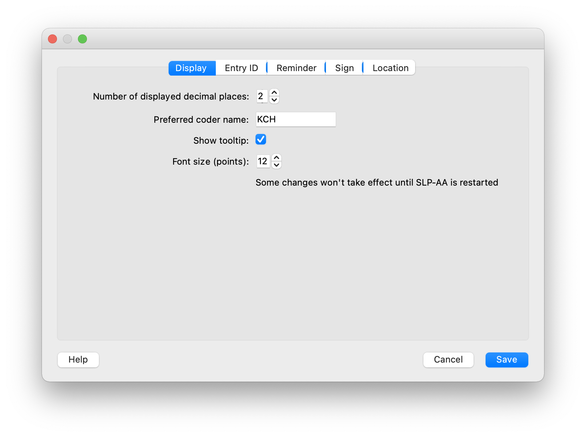
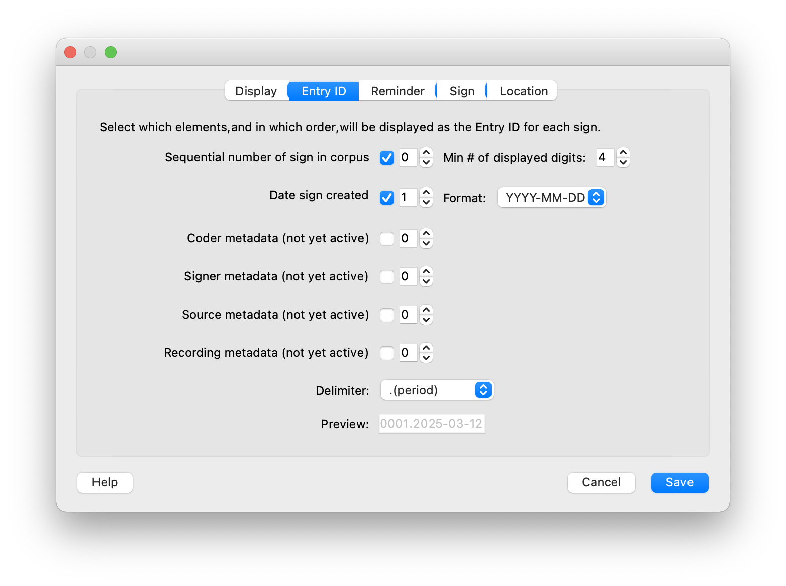
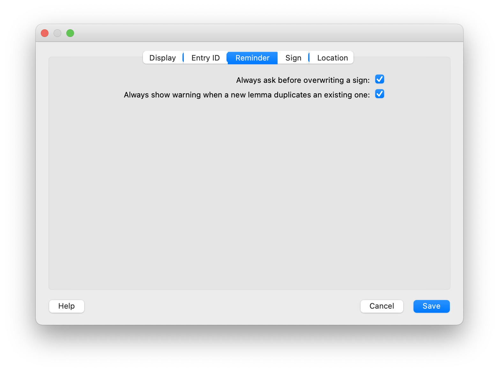
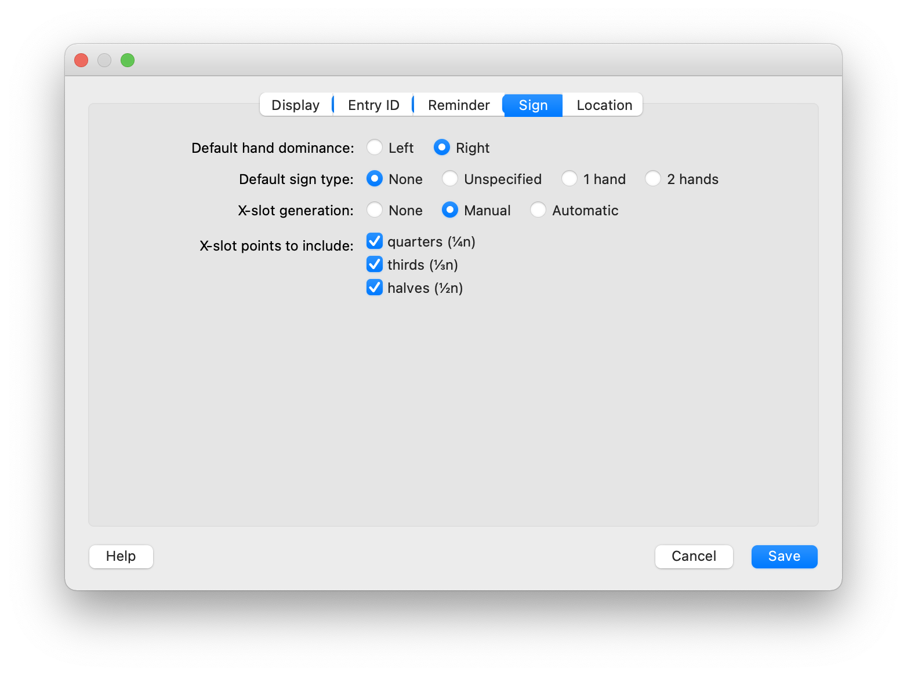
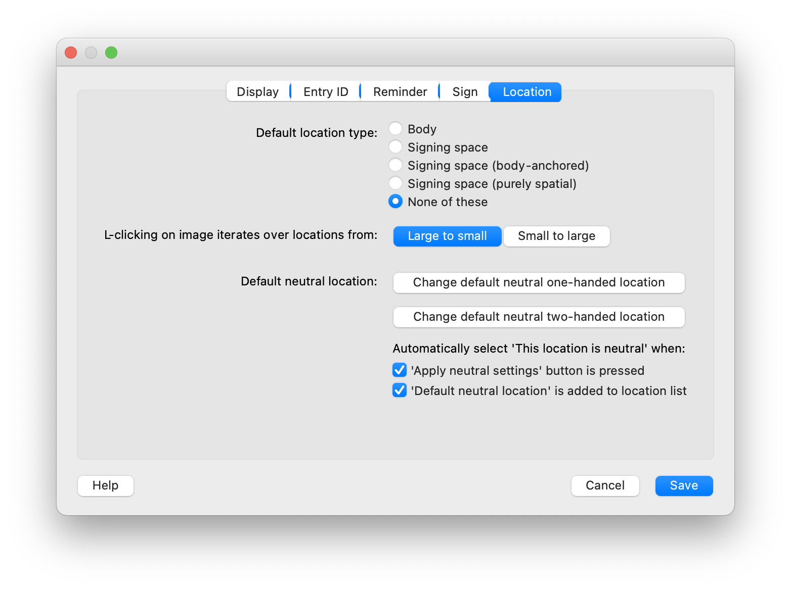

.. _setting_preferences:

*******************
Setting Preferences
*******************

Software preferences can be changed using the menu bar at the top of the screen and going to "Preferences."
You can look through them beforehand for intra-corpus consistency, or you can adjust 
them anytime during transcription.

.. _display:

Display
------------------

The "Display" tab allows you to set various parameters related to what information is displayed, including the number of decimal places for calculated values, the default coder name, whether tooltips are displayed when hovering over elements, and what the default font size is. As noted, not all changes here will go into immediate effect; some will not be implemented until SLP-AA is restarted.

.. _entry-id:

Entry ID
------------------

In the "Entry ID" tab, you can specify which information will be **displayed** as the Entry ID for a corpus. Note that this is entirely cosmetic; all information associated with a sign is always available to be displayed as the Entry ID.

Currently (v. 0.1.0), the elements that can be selected are the sequential number of the sign in the corpus and the date that the sign was created. Both of these are auto-generated by the software and not themselves editable by the user. However, their display within the displayed Entry ID is editable; the number of digits for the id number and the format for the date can both be selected. The delimiter between elements can also be adjusted. A preview of the Entry ID using the selected display elements is shown at the bottom of the tab.

Meta-data options will be made available as part of the Entry ID once functionality is implemented.

.. _reminder:

Reminder
------------------

In the "Reminder" tab, you can specify whether certain warning / reminder messages are displayed. As of v. 0.1.0, these are: asking before overwriting a sign and showing a warning when there are duplicate lemmas. If these are common occurrences, it may be more efficient to turn off these reminders. 

.. _sign:

Sign
------------------

In the "Sign" tab, you can set a number of defaults that apply to all new signs that are added. These include the default hand dominance (left or right), the default sign type (none, unspecified, 1H, or 2H), the default x-slot generation (none, manual, or automatic; as of v. 0.1.0, there is no actual automatic functionality); and which x-slot subdivisions to include (quarters, thirds, and/or halves). 

Note that switching the default hand dominance or sign type only changes parameters on **new** signs, not on signs that have already been coded. However, switching the x-slot generation from "manual" to "none" will also turn off the **display** of existing x-slots on all signs. Turning it back from "none" to "manual" will re-show the display of x-slots; they are not deleted.

.. _location:

Location
------------------

In the "Location" tab, a variety of parameters related to the defaults for location modules can be set. 

First, you can set whether or not there is a default location pre-selected for all new signs, and if so, what type of location it is (see :ref:`location_module` for details on these types). 

Next, you can select whether you want clicking on the provided body images to cycle through locations from 'large' to 'small' or vice versa. For example, if the setting is 'large to small,' then clicking on the center of the body image will start by highlighting the 'torso'; clicking again will highlight just the 'upper torso,' and the clicking again will highlight just the 'chest/breast area.' While an area is highlighted, it can also be selected. If the setting is 'small to large,' then the order is reversed; the first click will highlight the smallest applicable area based on the location of the mouse (e.g. the 'chest/breast area'), and then subsequent clicks will highlight increasingly larger areas (e.g. 'upper torso' and then 'torso'). 

Third, various parameters associated with what is considered the 'neutral space' can be set. Within a :ref:`location_module`, there is a button that can be pressed to 'Apply default neutral' settings to that location. This preferences tab is where those default settings are determined. These can be separate for 1H and 2H sign types. Clicking on the relevant button (e.g. "Change default neutral one-handed location") opens a new window in which the setting for 'neutral' for that sign type can be selected. These can be either body-anchored (e.g. "torso") or purely spatial (e.g. "central on the horizontal axis, mid on the vertical axis, and in front / medium on the sagittal axis"). The selections here work the same way as in the :ref:`location_module`. Note that the default neutral selection is based on the *sign type* of the sign, not the specific number of hands an individual module is said to apply to.

Additionally, the checkbox within the :ref:`location_module` that specifies that a location should be *considered* a neutral location can be auto-checked in certain circumstances; these are selected in this tab. By default, it is auto-checked any time the "Apply neutral settings" button is itself selected or any time the text location called "Default neutral location" is manually added as the location. Either or both of these auto-selections can be turned off.

