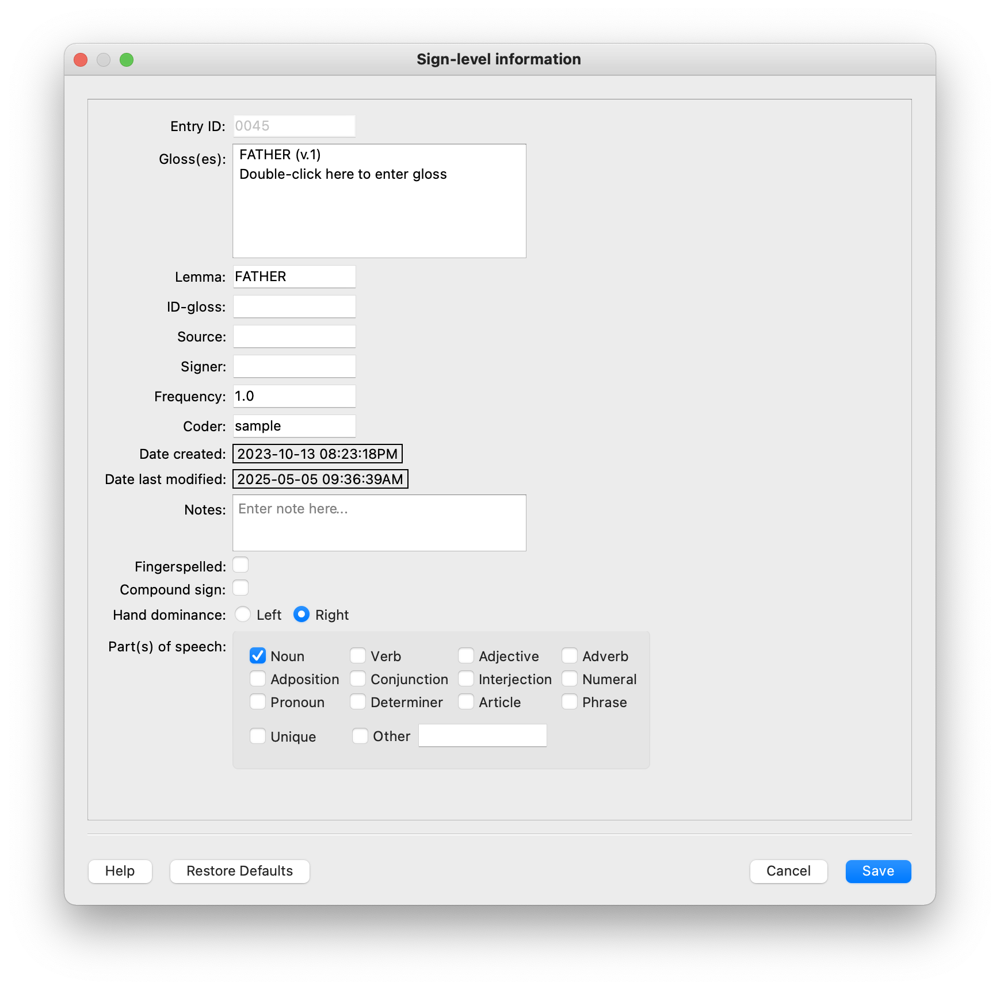

.. _sign_level_info:

*********************
Sign Level Information
*********************

This module provides a place to tag the particular corpus entry with relevant information, including information about the signer, the coder, the video, and the sign. This information may be used in searches to identify and group together signs based on shared sign level information. As of v. 0.2.0 (July 2025), part-of-speech information is also available to be tagged here. Note that if you have added part-of-speech tags to a corpus and then re-open and save the same corpus with an earlier version (e.g. v. 0.1.0), the part-of-speech information will be permanently lost, with no warning! Please make sure you are using the most up to date version of the software.

NB: There is slightly more detailed information about how glosses, lemmas, and ID-glosses relate to each other in :ref:`sample_corpus`. 

- **Entry ID**

The :ref:`entry_ID` will be generated automatically by SLP-AA. See :ref:`setting_preferences` for how to set preferences.

- **Gloss**

Write the :ref:`gloss` for the sign. Note: multiple glosses per sign are allowed. Double click in the location indicated to add an additional gloss. The process is iterative; once one gloss is entered, a new double-click location is added. Do not separate multiple glosses with commas, etc.

- **Lemma**

Write the :ref:`lemma` for the sign. 

- **ID-Gloss**

Write the :ref:`id-gloss` for the sign.

- **Source**

Select source from dropdown menu after they have been specified in :ref:`source_info_entry` **(to link to metadata documentation when created)**

- **Signer**

Select source from dropdown menu after they have been specified in :ref:`signer_info_entry` **(to link to metadata documentation when created)**

- **Frequency**

Include how often the sign occurs in the corpus.

- **Coder**

Select source from dropdown menu after they have been specified in :ref:`coder_info_entry` **(to link to metadata documentation when created)**

- **Last Updated**

This will be filled in automatically when you change any element of the sign.

- **Notes**

These notes will be attached to the particular sign in the corpus.

- **Fingerspelled**

Check the box if this is a fingerspelled sign.

- **Compound**

Check the box if this is a compound sign.

- **Hand Dominance**

Choose from one of the options L or R for the signer. Global settings for hand dominance can be specified by the user in :ref:`setting_preferences`.

- **Part(s) of Speech**

Check the box(es) for the part(s) of speech applicable for a given sign. Choices are mostly based on the [EAGLES tagset](https://home.uni-leipzig.de/burr/Verb/htm/LinkedDocuments/annotate.pdf) (p. 7), with "Pronoun" and "Determiner" split into separate categories, and the EAGLES' 'Residual' category labelled as "Other." The "Punctuation" category is not included here.

**insert image of sign_level_information box: give it filled out as an example sign** 
