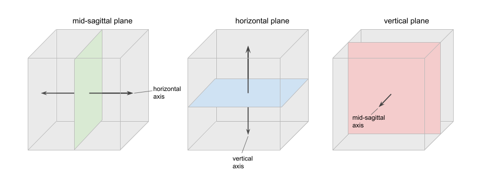
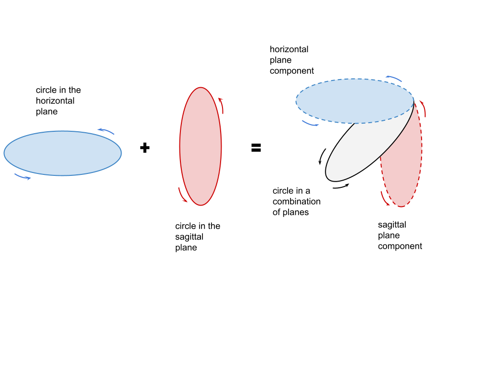
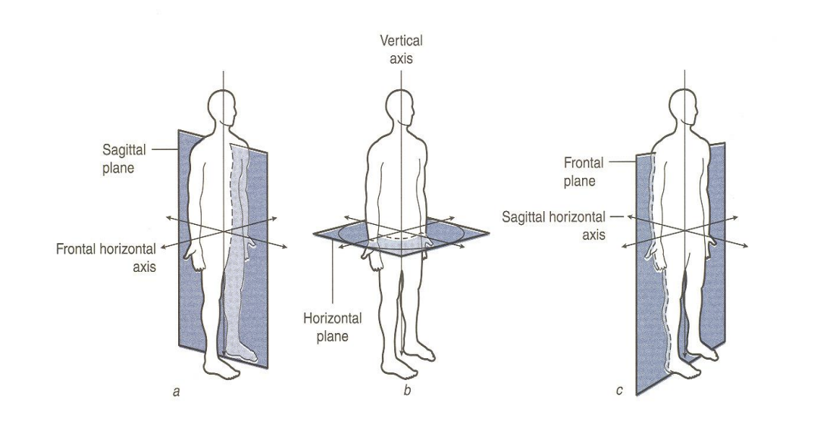

.. todo::
    sign example pair for (dynamic) direction and (static) location
    sign examples for each axis direction, plane, and circular directionality 
        - should be doubled from the movement docs, not a new set of examples
    replace the placeholder image currently in the 'summary' section
    amend the angled circular directions image to include the top of the circle for each plane
    diagrams
        - full, detailed overview of axes and planes
        - combination of axes
        - angled planes (no circular direction)
        - top of a circle 
        - circular directions (including top of the circle)
    fill in missing descriptions
    references?

.. comment:: 
    The documentations guidelines outline the information to be represented on this page as a general explanation of body geography, symmetry, planes, axes, the 'top' of a circle in each plane, **anatomical position (?)**, and ipsi-contra definitions.
    
.. comment::
    From sign type: "Everything is mirrored / in phase" should be selected if location, handshape, and orientation are all mirrored / in phase (synchronized). Signs are considered to be mirrored / in phase when both hands have the same specification at the same time; signs are considered to be not mirrored / out of phase when the hands have opposite specifications at the same time; see :ref:`signing space<signing_space_page>` for more information.
    
.. comment::
    Note that we don't prescribe how the system of planes and axes must be defined in terms of their relation to the signer. There is freedom for an interpretation of relative planes both through the relative orientation system and because the set of planes need not be rigidly defined. (For example, if a signer changes position or moves part of their body in a different direction, the sign directions can apply as usual to the signer's altered position.)

.. _signing_space_page:

***********************
Symmetry, Planes & Axes
***********************

**Introduction**

This page will describe the complexities of the three-dimensional signing space on and surrounding the body and explain the relevant terminology used throughout SLP-AA and here in its documentations.

.. note::
    Movement *direction* vs. static *location*. Use the left/right distinction relative to the intrinsic midline of the body. Grab a couple of sign examples to demonstrate. 
    
    Use the system overview to flag down every section where this will be relevant to think about, or otherwise just mention that it should be kept in mind for similar or identical descriptions used in differing contexts. Probably both.
    
    **Note** that the placement of this whole note may end up moving, but for now I like it here.

.. _axes_entry:

1. Axes and straight movements
``````````````````````````````

**Introduction**

The system used in this program to describe location, direction of movement, orientation, ..., **(add references and links here to the specific parts of the program where this information is required and their associated documentations)**, depends on an understanding of the three ordinate axes: **horizontal**, **vertical**, and **mid-sagittal**.

Each axis can be described in reference to the signer's body. The vertical axis extends in a straight line up and down, the horizontal extends to the left and right, and the mid-sagittal axis extends forwards and backwards. These can be seen here:

(working on this currently)

.. comment::
    .. image:: images/shared_axes.png
        :width: 750
        :align: left
        
.. _axis_directions:

I. Axis directions
==================

**Introduction**

.. _axis_default:

a) Default directions
~~~~~~~~~~~~~~~~~~~~~

**Definition (and possibly illustration) of default directions**

.. _axis_symmetry:

b) Symmetry in the horizontal axis
~~~~~~~~~~~~~~~~~~~~~~~~~~~~~~~~~~

**Complications from the horizontal axis in particular and any combinations involving it, the left/right system, interchangeability of the two horizontal systems, implications for 'same' direction in sign type**

[The issue with what horizontal symmetry even means: if the hands are moving towards each other, are they moving in the same direction? or if they're both moving to the signer's left, are they moving in the same direction? This is an issue with definition: the same in terms of what?]

.. comment::
    From the 'to mention' doc: One example of where right-left rather than ipsi-contra distinction is useful, if not necessary, is indicating (referential?) signs, as described in Johnson & Liddell 2021 (p. 136-138). Maybe give this example?

.. _combinations_axes:

c) Combinations of axes
~~~~~~~~~~~~~~~~~~~~~~~

**How to approach combinations of axes. Mention again that these must be considered to be additive in a single module, not sequential.**

.. comment::
    Keep in mind that a single module is meant to convey only one direction of movement, so selecting a combination of axes should be interpreted as a diagonal or angled movement with all of the selected directions applying simultaneously. See the note on :ref:`combinations of axes<combinations_axes>` for a visual description of how this works. For sequential movements along different axes, you should create multiple movement modules and use the :ref:`x-slot visualization window<sign_summary>` to assign a temporal order to the movement sequence.
    
    `FOCUS <https://asl-lex.org/visualization/?sign=focus>`_

.. note::
    From the 'to mention' doc: It might be useful to give some examples of how our perceptual movement direction combination (e.g., up-ipsi, etc.) correspond to Johnson & Liddell’s (2021) vertical and horizontal “directions of bearing” (p.140-141, fig. 8-9)

.. comment::
    It is **possible**, though perhaps too technically involved, to include notions like: sets of parallel planes; normal vectors; spans; cartesian coordinate triples in space; movement vector triples in space; etc.
    
    It is **likely** that we will need to include notions like: direction of movement relative to an arbitrary starting point; vectors parallel to/able to form bases for ordinate axes (and later planes); vector addition/combinations of axes; etc.

.. _planes_entry:

2. Planes and circular movements
````````````````````````````````

.. _planes_section:

I. Planes
=========

.. warning::
    To be able to cover everything below the 'Planes' node, background information required includes: the basics of ipsi/contra and left/right; potentially a little in-depth discussion of normal vectors (though hopefully not strictly necessary here, and likely not in those words); basic knowledge of the axis directions applicable for the (two) ordinate axes that form a basis for each plane; etc.
    
    Be sure that these are adequately covered above.

We can also describe a set of planes, where each one is formed by a pair of the ordinate axes described above. These are the **horizontal**, **vertical**, and **mid-sagittal** planes. (In the following diagram, the signer would be facing toward the front side of the cube.)


        
**Describe angled planes here, without reference to circular directions. Include a diagram similar to the above.**

.. _circular_directions:

II. Circular directions
=======================

**Introduction**

.. _top_of_circle:

a) 'Top' of a circle
~~~~~~~~~~~~~~~~~~~~

**State the point on a circle in each plane that we define to be the top of a circle in that plane. Note especially that this notion is independent from movement. Then introduce the idea of circular directionality (in movement) as defined by the (axis) direction of movement through the topmost point for that plane. Needs a set of diagrams.**

.. _plane_default:

b) Default directions
~~~~~~~~~~~~~~~~~~~~~

**Definition (and possibly illustration) of default directions, in reference to the top of the circle. Start with the mid-sagittal plane to describe the simple case, then the vertical, then horizontal.**

.. _plane_symmetry:

c) Symmetry in planes involving the horizontal axis
~~~~~~~~~~~~~~~~~~~~~~~~~~~~~~~~~~~~~~~~~~~~~~~~~~~

.. comment::
    Check the most current language in the movement page to see if this heading should be altered
    
**Complications from the horizontal axis in particular, i.e. for the vertical and horizontal planes and any combinations involving these, the left/right system, interchangeability of the two horizontal systems, implications for 'same' direction in sign type.**

.. _circular_combinations:

d) Directions in combinations of planes
~~~~~~~~~~~~~~~~~~~~~~~~~~~~~~~~~~~~~~~

Sometimes circular shapes don't line up perfectly within one of the cardinal planes. 

.. comment::
    Keep in mind that a single module is meant to convey only one direction of movement, so selecting a combination of planes should be interpreted as a diagonal or angled movement with all of the selected planes (and circular directions, if applicable) applying simultaneously. See the description of :ref:`combinations of planes<planes_entry>` and :ref:`angled circular directions<circular_combinations>` for a visual description of how this works. For sequential movements in different planes, you should create multiple movement modules and use the :ref:`x-slot visualization window<sign_summary>` to assign a temporal order to the movement sequence.
    
    `SOCIALIZE <https://www.handspeak.com/word/index.php?id=2014>`_



.. _symmetry_review:

III. The signing space
======================

**Detailed summary for quick reference, consisting mostly of a set of visuals and sign examples.**

**Quick and simple review of everything mentioned so far in terms of the basics of planes and axes, i.e. put these together with detailed illustrating images and just go for an overview of our cartesian system and the labels for each component. Focus on the competing options for describing horizontal symmetry. Hopefully this will be a good way to easily reference the important information without digging through the whole page.**



**Note: This image is a placeholder and must be replaced when we have something suitable. It was taken from https://www.physical-solutions.co.uk/wp-content/uploads/2015/05/Understanding-Planes-and-Axes-of-Movement.pdf, and it's similar to what I would want to have here other than some alterations to the plane and axis labels**

.. _tbd_location_symmetry:

3. (Title)
```````````

**All above information as applicable to smaller locations and/or on-body locations. Needs more planning, and will likely be coordinated with the Location module documentations. For now this is just a general concept of something we will need later on.**

.. _symmetry_puzzle:

4. The horizontal axis
``````````````````````

**Introduction. This section is all fun theory and brainbusters! Everything above this is necessary to understand for the program, but from here onwards is for additional and not-strictly-necessary information.**

.. note::
    To include here:
    
    {Introduction to the particular difficulties introduced with horizontal symmetry over any other kind}
    
    -->    {The (set of) mid-sagittal plane(s) as normal to the horizontal axis}
        
    {Anatomical symmetry across the "midline," or whatever terminology}
    
    -->    Terminology: Line of bi-lateral symmetry (from Battison), or plane of horizontal symmetry, or plane of bisection, or other. Which one of these is the clearest/simplest? Is there a term used more often in sign language linguistics or sign language teaching? This cannot be referred to as the mid-sagittal plane, as it must specifically be horizontally central to the body (meanwhile a generic mid-sagittal plane can still be described to either side of the body).
    
    {Why the discrepancy? Difficulties in articulation mechanisms}
    
    --> Comment on low instances of simultaneous movement along sufficiently different axes and/or planes for each hand, e.g. an axis on one hand AND a plane on the other. Link this to difficulties wrapping our heads around complex combinations of movement in the mid-sagittal plane. Like trying to pat your head and rub your stomach, it takes more concentration and effort than moving in what we can easily conceptualize as the 'same' direction, with all of the baggage that that generalization comes along with.

