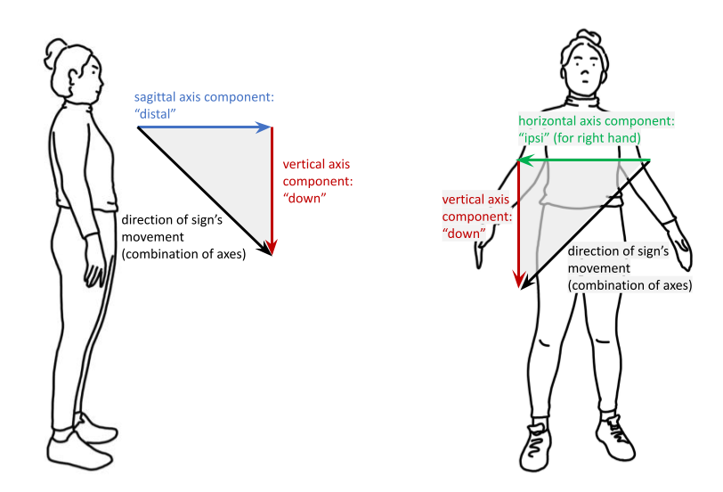
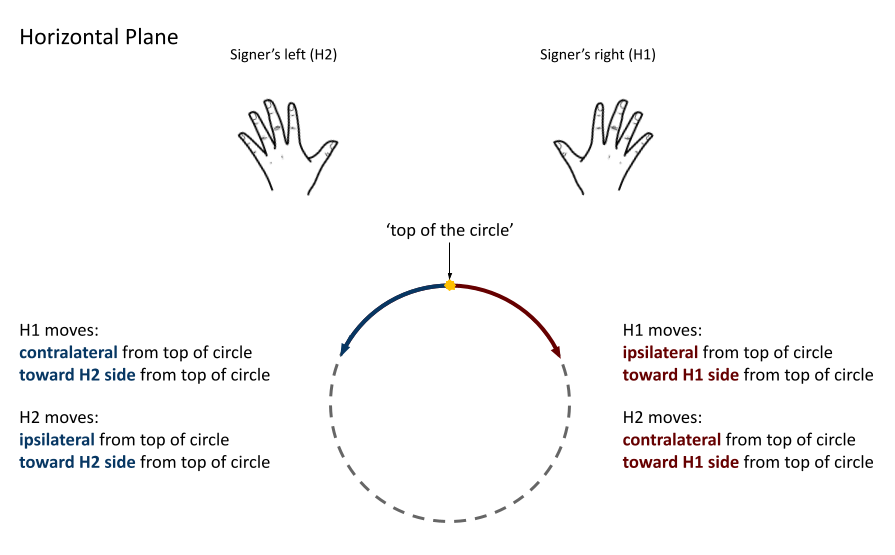
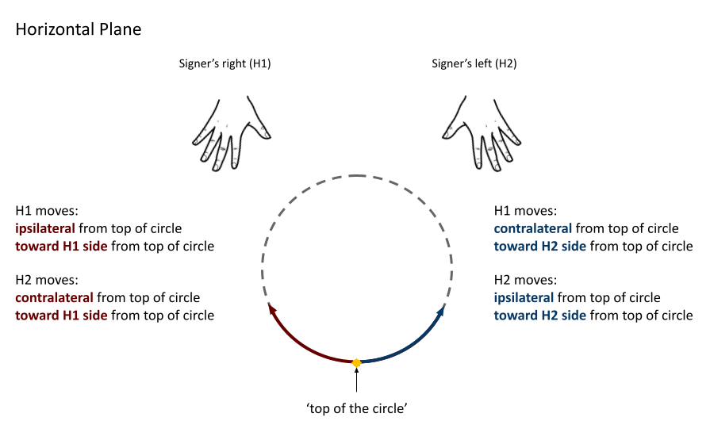

.. todo::
    update screenshots of SOCIALIZE and FOCUS
    replace current placeholders with diagrams
        - multiple sets of axes superimposed on one image
        - multiple sets of planes superimposed on one image
        - summary image
    add references
        - Johnson & Liddell
        - (potentially) Battison 1978
        - Canadian ASL dictionary?
    keep track of the comments at the bottom of 'symmetry'

.. comment:: 
    The documentations guidelines outline the information to be represented on this page as a general explanation of body geography, symmetry, planes, axes, the 'top' of a circle in each plane, anatomical position, and ipsi-contra definitions.

.. _signing_space_page:

***********************
Symmetry, Planes & Axes
***********************

This page will describe and define the terminology used throughout SLP-AA and here in its documentations in reference to the signing space on and surrounding the body. There is a fairly high level of complexity when dealing with motion in three-dimensional space, but our aim is that the visual and textual descriptions provided here will help to reduce any difficulty in interpreting the program's options and adapting them to the requirements of the individual user. 

The program relies on a system of axes and planes to frame three-dimensional space, and these are positioned relative to whichever arbitrary point makes the most sense for each sign component. This system is reapplied in several areas of the program, so many elements operate in the same way and knowing how to use one component will usually also help with being able to understand others.

.. note::
    **Modularity and timing**
    
    SLP-AA incorporates the use of :ref:`modules<module>` to code sign aspects like :ref:`Hand Configuration<hand_configuration_module>`, :ref:`Location<location_module>`, :ref:`Movement<movement_module>`, :ref:`Orientation<orientation_module>`, and so on. For more discussion on the use of modules in SLP-AA to encode information about signs, see :ref:`modularity`.
    
    Module instances link to generic :ref:`x-slots<x_slot>` to record information about their timing relative to any others within a sign. For more information on the use of x-slots in SLP-AA, consult :ref:`timing_page`.

.. _axes_entry:

1. Axes
````````

The primary spatial system used in SLP-AA is based on a set of three :ref:`cardinal_axes`: the **horizontal**, **vertical**, and **sagittal** axes. Each axis is perpendicular to the other two.

These axes can be described in reference to any given point on the signer's body or in the general signing space, depending on what is required for the situation. The horizontal extends to the left and right from a generic reference point, the vertical axis extends in a straight line up and down, and the sagittal axis extends forwards and backwards. These can be seen here, labelled with SLP-AA's :ref:`default direction settings<axis_default>`:


There is a good amount of flexibility in the program for users to decide on an interpretation of the axis system that suits their needs. The axes can be defined relative to the positioning of the signer's body or the direction that they're facing, or to a relevant part of the body, for example. The central point of origin can be adapted as necessary for the situation, as long as the cardinal axes are always oriented in the same way relative to each other.

.. image:: images/placeholder.png
    :width: 750
    :align: left

**(Multiple sets of axes superimposed to show that they can shift as needed.)**

.. _axis_directions:

I. Axis directions
==================

.. _axis_default:

a) Cardinal axis directions
~~~~~~~~~~~~~~~~~~~~~~~~~~~

The pairs of endpoint directions for each axis are outlined here with sign examples involving a :ref:`perceptual_shape` traced out in the given direction. However, the axis system applies across modules, not just for movement. These examples are meant to clearly display what is meant by each direction label. See the note below for sign coding examples that apply this system to location and orientation as well.

Keep in mind that it is possible to select only the axis itself without a specific endpoint direction wherever a selection for an axis or direction applies in the program. 

The directions for the horizontal axis depend on the preferences of the user. These adhere to one of two models for the horizontal axis, either **relative** (:ref:`ipsilateral`/:ref:`contralateral`) or **absolute** (toward H1/H2). This is described in greater detail in :ref:`Symmetry<symmetry_section>` below. The horizontal axis options can be toggled separately for different modules; see the :ref:`global_settings` for how to change these options and to see which one applies by default for each module.
    
* **Horizontal axis: relative**

    * **Ipsilateral**, as in `SAUSAGE <https://asl-lex.org/visualization/?sign=sausage>`_
    * **Contralateral**, as in `GAME <https://asl-lex.org/visualization/?sign=game>`_ 

OR

* **Horizontal axis: absolute**
    
    * **Toward H1**, as in the right hand of `SAUSAGE <https://asl-lex.org/visualization/?sign=sausage>`_ or the left hand of `GAME <https://asl-lex.org/visualization/?sign=game>`_
    * **Toward H2**, as in the left hand of `SAUSAGE <https://asl-lex.org/visualization/?sign=sausage>`_ or the right hand of `GAME <https://asl-lex.org/visualization/?sign=game>`_

The endpoints for the vertical and sagittal axes are consistent wherever they appear. 

* **Vertical axis**

    * **Up**, as in `UMBRELLA <https://asl-lex.org/visualization/?sign=umbrella>`_ or `NORTH <https://asl-lex.org/visualization/?sign=north>`_
    * **Down**, as in `LOSE_GAME <https://asl-lex.org/visualization/?sign=lose_game>`_ or `DRAW <https://asl-lex.org/visualization/?sign=draw>`_
    
* **Sagittal axis**

    * **Distal**, as in `NEXT <https://asl-lex.org/visualization/?sign=next>`_ or `SINCE <https://asl-lex.org/visualization/?sign=since>`_
    * **Proximal**, as in `BEFORE <https://asl-lex.org/visualization/?sign=before>`_ 

.. note::
    **Axis direction for location and orientation**
    
    Assuming that the horizontal axis is defined in relative (ipsi/contra) directions for all modules:
    
    * In `RAINBOW <https://asl-lex.org/visualization/?sign=rainbow>`_, the dominant hand moves in the ipsilateral *direction* (toward the signer's right, in this case), and it changes *location* within neutral space from the contralateral to the ipsilateral side of the body. The *orientation* of the hand changes in the production of the sign, starting with the finger roots pointing down and the palm facing the ipsilateral direction and finishing with the finger roots pointing up and the palm facing the contralateral direction.
    
    * In `SLICE_2 <https://asl-lex.org/visualization/?sign=slice_2>`_, the dominant hand moves in a proximal and ipsilateral *direction* (toward the signer's right, in this case), but its *location* starts in neutral space on the contralateral side and ends at the midline of the body without ever crossing over to the ipsilateral side. The *orientation* of the hand is unchanging, with the finger roots angled in the distal and contralateral directions and the palm angled to face the proximal and contralateral directions.
    
.. _angled_axes:

b) Angled axes
~~~~~~~~~~~~~~

Sometimes the axis direction of a perceptual shape is traced along an **angled path** rather than one of the :ref:`cardinal_axes`, as in `FOCUS <https://asl-lex.org/visualization/?sign=focus>`_ and `SNOW_2 <https://asl-lex.org/visualization/?sign=snow_2>`_. In this case, the angled path is made up of a combination of two or all three of the cardinal axes. See the following illustration for how this works:



In these examples, the sign includes the black line traced out in an angled direction. The angled line can be "flattened" into each of its component cardinal axes, and then the resulting axis directions are simpler to record and analyze. The information to record in the program for this example should then be the directions indicated for the coloured lines along each of their respective cardinal axes.

Here is a possible coding of `FOCUS <https://asl-lex.org/visualization/?sign=focus>`_, highlighting its two component axis directions within one module:

.. image:: images/mov_sample_sign_FOCUS.png
    :width: 750
    :align: left

This is also the case for other modules that use the axis system, as in angled orientations and locations (which may be described as displaced in more than one direction in comparison between two hands or from the beginning to the end of the sign production).

When multiple axes or directions are selected within one instance of a module, this is always interpreted as an angled axis with all selections applying simultaneously (according to the associated :ref:`timing values<timing_page>`). To instead indicate a sequence of directions, create multiple instances of the applicable module, associate them with separate (and sequential) :ref:`timing values<timing_page>`, and select the appropriate direction for each one.

.. warning::
    **(For Kathleen and Oksana)**
    
    From the 'to mention' doc: It might be useful to give some examples of how our perceptual movement direction combination (e.g., up-ipsi, etc.) correspond to Johnson & Liddell’s (2021) vertical and horizontal “directions of bearing” (p.140-141, fig. 8-9). 

.. _planes_entry:

2. Planes
``````````

We can also describe a set of :ref:`cardinal_planes`, where each plane is formed by a pair of the :ref:`cardinal_axes` described above. These are the **horizontal**, **vertical**, and **sagittal** planes. Each plane is perpendicular to the other two.

The horizontal plane is formed by the horizontal and sagittal axes. The vertical plane is formed by the vertical and horizontal axes. The sagittal plane is formed by the sagittal and vertical axes. These are shown here:

.. image:: images/shared_planes.png
    :width: 750
    :align: left

As with the system of axes, the program is quite flexible so that users can decide on an interpretation of the plane system that suits their needs. The planes can be defined relative to the positioning of the signer's body or the direction that they're facing, or to a relevant part of the body, for example. The set of cardinal planes are not fixed in space, and they can move as necessary as long as the planes are always oriented in the same way relative to each other and to the system of cardinal axes as applied for the same circumstance.

.. image:: images/placeholder.png
    :width: 750
    :align: left

**(Multiple sets of planes superimposed to show that they can shift as needed)** 

.. note::
    **Angled planes**
    
    Planes on an angle are made up of component combinations of two or all three of the cardinal planes. This is indicated in the module by selecting multiple planes at once within a single instance.
    
    Also see the section on :ref:`Angled circular directions<angled_circles>` below, which includes a sample coding involving an angled plane.
    
    When multiple planes are selected within one instance of a module, this is always interpreted as an angled plane with all selections applying simultaneously (according to the associated :ref:`timing values<timing_page>`). To instead indicate a sequence where each plane applies separately, create multiple instances of the applicable module, associate them with separate (and sequential) :ref:`timing values<timing_page>`, and select the appropriate plane for each one.

.. _circular_directions:

I. Circular (non-straight) directions
=====================================

Within each plane, signs involving a non-straight :ref:`perceptual_shape` (e.g., circles, arcs, zigzags, etc.) can be traced out in one of two circular directions. Unlike the :ref:`Axis direction<axis_directions>` options, this section applies only to the :ref:`movement_module`, as it is only relevant for describing motion.

.. _circular_definitions:

a) Defining circular direction
~~~~~~~~~~~~~~~~~~~~~~~~~~~~~~

Note that this section applies to any :ref:`perceptual_shape` sign other than *straight*. (For a *straight* perceptual shape sign, circular direction is automatically selected by the program as *not relevant*.)

Rather than defining formal definitions of which direction is meant to be 'clockwise' or 'counter-clockwise' for each plane, which is not always memorable or intuitive and can be difficult to keep track of through changing perspectives (and also may not apply consistently depending on whether a signer is right- or left-handed), the system for circular direction in SLP-AA is built directly on the system for :ref:`Axis direction<axis_directions>`. 

We define a point to be the **top of a circle** for any given circular shape in each of the three :ref:`cardinal_planes`, and then the circular direction follows based on the axis direction of the hand as it moves through that point. If the hand does not reach the top of the circle in a particular sign,  the direction should still be defined based on how the hand **would** move through the top point if it continued in the same direction. It also does not matter where the hand happens to start making the circle; the circular direction is determined by where the hand moves from the top, whenever it happens to get there.

.. note::
    **Circles and symmetry**

    Since the system for circular direction is based on our system for axis direction, the distinction between the **relative** (:ref:`ipsilateral`/:ref:`contralateral`) and **absolute** (toward H1/H2) models for the horizontal axis applies here as well, and it will affect the vertical and horizontal planes. These models are described in greater detail in :ref:`Symmetry<symmetry_section>` below. The set of options for circular direction will correspond to your choices for the :ref:`movement_module` as set in the :ref:`global_settings`, which means that the relative set of options applies by default unless you choose to change it.

**Horizontal plane**

The horizontal plane does not have a clear point that would be considered the 'top' of a circle, so we define it to be the point that is furthest away from the speaker (that is, the most **distal** point). When the hand sits at that point, it can start to move to either side in a horizontal direction. The dominant hand, for instance, can move in the ipsilateral direction (toward the H1 side) or in the contralateral direction (toward the H2 side) before continuing to complete the circular shape.

Directions in the horizontal plane from the perspective of the signer:



Directions in the horizontal plane when facing the signer:



The set of options for circular directions in the horizontal plane are:

Relative [Default]

* **Ipsilateral from the top of the circle**, as in `SWIM <https://asl-lex.org/visualization/?sign=swim>`_ or the left hand of `DECORATE_2 <https://asl-lex.org/visualization/?sign=decorate_2>`_
* **Contralateral from the top of the circle**, as in `CELEBRATE <https://asl-lex.org/visualization/?sign=celebrate>`_ or the right hand of `DECORATE_2 <https://asl-lex.org/visualization/?sign=decorate_2>`_

OR

Absolute

* **Toward H1 side from the top of the circle**, as in the left hand of `CELEBRATE <https://asl-lex.org/visualization/?sign=celebrate>`_ 
* **Toward H2 side from the top of the circle**, as in `DECORATE_2 <https://asl-lex.org/visualization/?sign=decorate_2>`_ or the right hand of `CELEBRATE <https://asl-lex.org/visualization/?sign=celebrate>`_

**Vertical plane**

The vertical plane has a clear 'top' point of a circle at the highest (that is, most **up**) point. While the hand sits at the top of the circle, it can start to move within the plane toward one horizontal side or the other. This means that the same set of circular directions applies for the vertical plane as for the horizontal plane.

Directions in the vertical plane from the perspective of the signer:


Directions in the vertical plane when facing the signer:


The set of options for circular directions in the vertical plane are:

Relative [Default]

* **Ipsilateral from the top of the circle**, as in `RAINBOW <https://asl-lex.org/visualization/?sign=rainbow>`_
* **Contralateral from the top of the circle**, as in `ENJOY <https://asl-lex.org/visualization/?sign=enjoy>`_

OR

Absolute

* **Toward H1 side from the top of the circle**, as in `RAINBOW <https://asl-lex.org/visualization/?sign=rainbow>`_ or the left hand of `ENJOY <https://asl-lex.org/visualization/?sign=enjoy>`_
* **Toward H2 side from the top of the circle**, as in the right hand of `ENJOY <https://asl-lex.org/visualization/?sign=enjoy>`_

**Sagittal plane**

The sagittal plane also has a clear 'top' point of a circle at the highest (that is, most **up**) point. While the hand sits at the top of the circle, it can start to move within the plane away from the speaker in the distal direction or toward the speaker in the proximal direction before continuing to complete the circular shape. 


The set of options for circular directions in the sagittal plane are:

* **Proximal from the top of the circle**, as in `BACK_UP <https://asl-lex.org/visualization/?sign=back_up>`_ or `ROW <https://asl-lex.org/visualization/?sign=row>`_
* **Distal from the top of the circle**, as in `BICYCLE <https://asl-lex.org/visualization/?sign=bicycle>`_ or `REASON <https://www.handspeak.com/word/index.php?id=3974>`_

.. note::
    **Circular shapes that don't pass through the top of the circle**
    
    Circular perceptual shapes can travel at least one full circuit of a circular path, as in `BICYCLE <https://asl-lex.org/visualization/?sign=bicycle>`_, or they can travel a smaller section of the circle, as in `SHOVEL <https://asl-lex.org/visualization/?sign=shovel>`_ or `RAINBOW <https://asl-lex.org/visualization/?sign=rainbow>`_. Even if the hand does not ever reach the point defined as the top of the circle in that plane, the circular direction of the movement is defined in terms of how the hand *would* pass through that point, if it continued on its path. 
    
    This means that both `SHOVEL <https://asl-lex.org/visualization/?sign=shovel>`_ and `RAINBOW <https://asl-lex.org/visualization/?sign=rainbow>`_ would be coded as moving *toward H1 from the top of the circle*, even though only one of these signs actually passes through the top of the circle.

.. _angled_circles:

b) Angled circular directions
~~~~~~~~~~~~~~~~~~~~~~~~~~~~~

Sometimes circular shapes are traced within an **angled plane** rather than one of the :ref:`cardinal_planes`, as in `SOCIALIZE <https://www.handspeak.com/word/index.php?id=2014>`_ and `TWIRL <https://asl-lex.org/visualization/?sign=twirl>`_. In this case, code the angled plane of movement by finding the applicable component planes (as described in the note on angled planes above), and then continue to code the circular direction by selecting each of the component directions within their respective component (cardinal) planes. 

See the following illustration for how this works:

.. image:: images/mov_combinations_of_planes.png
    :width: 750
    :align: left

In this example, the sign includes the black circle traced out in an angled plane. The idea is that the angled circle could be "flattened" into each of its components, and then the resulting circular directions are simpler to record and analyze. Then the information to record in the program for this example should be each of the directionalities indicated for the coloured circles, which are situated in cardinal planes.

Here is a possible coding of a movement module for `SOCIALIZE <https://www.handspeak.com/word/index.php?id=2014>`_, highlighting the combined circular direction components:

.. image:: images/mov_sample_sign_SOCIALIZE.png
    :width: 750
    :align: left

When multiple directions are selected within one instance of a module, this is always interpreted as an angled direction with all selections applying simultaneously (according to the associated :ref:`timing values<timing_page>`). To instead indicate a sequence of directions, create multiple instances of the appropriate module, associate them with separate (and sequential) :ref:`timing values<timing_page>`, and select the appropriate direction for each one.

.. _symmetry_section:

3. Symmetry
```````````

SLP-AA uses a simple and adaptable spatial structure to describe the position and movement of the hands and body while signing. This is built on :ref:`Axis locations and directions<axis_directions>` for :ref:`cardinal_axes`, and the same set of directions as they apply to :ref:`Circular directions<circular_directions>` for :ref:`cardinal_planes`. These selection options apply across the program's :ref:`modules<module>` where relevant, including the :ref:`movement_module`, the :ref:`Location<location_module>` and :ref:`Hand Part<hand_part_module>` modules, the :ref:`relation_module`, the :ref:`orientation_module`, and the :ref:`nonmanual_module`.

All of this involves two interchangeable models for interpreting horizontal symmetry, which apply to any specifications that involve the horizontal axis, including the horizontal axis itself and the vertical and horizontal planes. All other cardinal planes and axes lie perpendicular to the horizontal axis, so this particular kind of symmetry will not apply.

.. note::
    **Why two models?**

    Depending on interpretation, it could be equally valid that both hands moving toward (or positioned at) the signer's dominant or subordinate side have the "same" direction (or position), or that both hands moving (or positioned) in a way that forms a mirror image across the midline of the body have the "same" direction (or position). We want to allow for either interpretation to be able to take priority in any given corpus.

    In `DECORATE_2 <https://asl-lex.org/visualization/?sign=decorate_2>`_, both hands are following the same circular path in space at the same time, and in `CLOUD_1 <https://asl-lex.org/visualization/?sign=cloud_1>`_, both hands are following the same paths in their own respective directions at the same time. Both of these movements are intuitive to produce and interpret as long as the hands are moving horizontally in some way.
    
    For each of the spatial models available in SLP-AA to describe these movements, both hands will **share** a specification for movement direction for one of these examples, and they will have **opposite** specifications for the other example.

In order to remain explicit as to the phonetic details of each sign and allow for simpler phonological analysis, users can choose whether selections involving the horizontal axis are displayed with **absolute** options (moving toward, facing, or located at the signer's H1/H2 side) or **relative** options (moving toward, facing, or located at each hand's :ref:`ipsilateral`/:ref:`contralateral` side) for each module. These can be changed in the :ref:`global_settings`.

For the absolute interpretation, the hands moving towards or away from the signer's dominant side are moving in the "same" direction and the hands moving towards or away from each other are moving in different directions. The hands share a specification when they are on the same side of the body or when they are following the same path in space, like `DECORATE_2 <https://asl-lex.org/visualization/?sign=decorate_2>`_.

For the relative interpretation, the hands moving towards or away from each other are moving in the "same" direction and the hands moving towards or away from the signer's dominant side are moving in different directions. The hands share a specification when they are mirrored across both sides of the body or each moving in their own respective direction, like `CLOUD_1 <https://asl-lex.org/visualization/?sign=cloud_1>`_.

Crucially, any kind of sign can still be described accurately with either interpretation. There is no articulatory difference, for instance, between the dominant hand moving to the H1 side or in the ipsilateral direction, and similarly for the subordinate hand moving to the H2 side or in the ipsilateral direction. 

The choice is only a matter of prioritizing one interpretation over the other for coding purposes, and selecting one interpretation does not mean discarding the other as inaccurate. In fact, all of the information recorded in one model can easily be recovered and converted to the other. Since the models are interchangeable, it is a matter of user preference for the particular corpus and/or module.

.. note::
    **Exclusion of other kinds of symmetry**
    
    Though there may be noteworthy information to focus on for other kinds of symmetry, we have only incorporated consideration for symmetry in the horizontal axis into the design of the program. We give this particular attention due to the natural bilateral symmetry of the human body across both sides of the :ref:`mid_sagittal_plane`.
    
    For instance, we don't have any examples of signs that involve both hands moving in opposite :ref:`circular directions<circular_directions>` in the sagittal plane (as this is articulatorily very difficult), but there are many examples of signs that involve the hands moving in any combination of circular directions in the vertical and horizontal planes.
    
.. comment:: 
    Point out parts of the program that rely on these interpretations, and should be interacted with differently depending on the choice.
    
        * movement: perceptual shape *axis direction* and *plane* options (only *circular direction*)
        * orientation: all options (palm direction, finger root direction)
        * nonmanuals: all options, more or less
        * relation: all options, more or less
        * location and hand part: discontiguous ipsi/contra or H1 side/H2 side sections, and sub-areas and surfaces
        * phasing?
            
            * movement: whole instance of module flagged as in or out of phase (if not out of phase: can be connected)
            * location: whole instance of module can be flagged as connected, no explicit phasing
            * internally, we don't apply the question of phasing to horizontal movements at all (only vertical straight shapes and all sagittal shapes)
        
        * anything that mentions the "same" or "different/opposite" direction, location, orientation, etc.
            
            * as of now, this is **only** in *Movement>Perceptual shape* for *Plane*.

.. comment::
    {Why the discrepancy? Why is horizontal symmetry special?}
    
    → Difficulties in articulation mechanisms, anatomical limitations AND strengths
    
    → Comment on low instances of simultaneous movement along sufficiently different axes and/or planes for each hand, and link this to difficulties wrapping our heads around complex combinations of movement in the mid-sagittal plane (the only one that does not involve the horizontal axis).
    
    → Like trying to pat your head and rub your stomach, it takes more concentration and effort than moving in what we can easily conceptualize as the 'same' direction, with all of the baggage that that generalization comes along with.
    
    → (Also link this to our broad categories in sign type for moving 'similarly' vs. 'differently' are more likely to apply with only minimal/predictable differences, e.g. simple alternation.)

.. _symmetry_review:

4. The signing space
````````````````````

**Detailed summary for quick reference, consisting mostly of a set of visuals and sign examples.**

**Include:** Quick and simple review of everything mentioned so far in terms of the basics of planes and axes, i.e. put these together with detailed illustrating images and just go for an overview of our cartesian system and the labels for each component. Focus on the competing options for describing horizontal symmetry. Hopefully this will be a good way to easily reference the important information without digging through the whole page.

.. image:: images/placeholder.png
    :width: 750
    :align: left

.. warning::
    This placeholder should be replaced with a detailed image (or set of images) that shows a full summary of the set of cardinal axes and planes with all possible directions labelled appropriately, including both sets of options for directions involving the horizontal axis. This would preferably be shown with a demonstrated reference to the direction of the signer's body.
