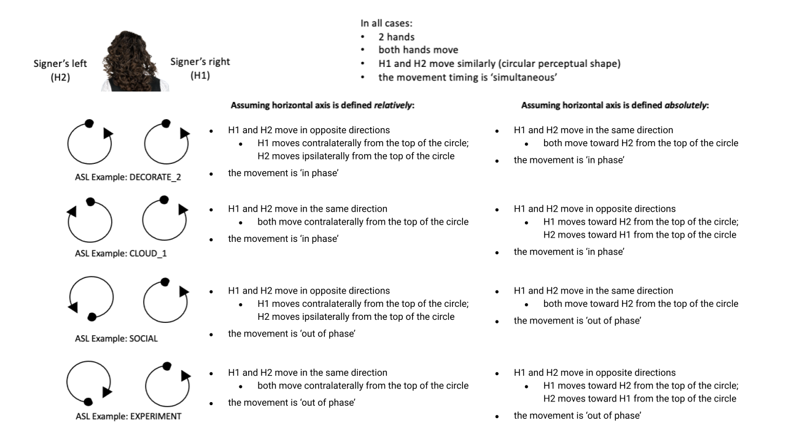

.. todo::
    copy sign examples for axis/direction
    "" for plane/circular directionality
    replace current placeholders with diagrams
        - summary image
        - top of a circle/circular directions
    add references
        - Johnson & Liddell
        - (potentially) Battison
        - Canadian ASL dictionary?
    **images currently show 'mid-sagittal' in the program:**
        - SOCIALIZE H1
        - SOCIALIZE H2

.. comment:: 
    The documentations guidelines outline the information to be represented on this page as a general explanation of body geography, symmetry, planes, axes, the 'top' of a circle in each plane, anatomical position, and ipsi-contra definitions.
    
.. comment::
    From sign type: "Everything is mirrored / in phase" should be selected if location, handshape, and orientation are all mirrored / in phase (synchronized). Signs are considered to be mirrored / in phase when both hands have the same specification at the same time; signs are considered to be not mirrored / out of phase when the hands have opposite specifications at the same time; see :ref:`signing_space_page` for more information.

.. _signing_space_page:

***********************
Symmetry, Planes & Axes
***********************

This page will describe and define the terminology used throughout SLP-AA and here in its documentations in reference to the signing space on and surrounding the body. There is a fairly high level of complexity when dealing with motion in three-dimensional space, but our aim is that the visual and textual descriptions provided here will help to reduce any difficulty in interpreting the program's options and adapting them to the requirements of the individual user. 

The program relies on a system of axes and planes, which are positioned relative to any arbitrary point, to frame three-dimensional space. This system is reapplied in several components of the program, so that many elements operate in the same way and knowing how to use one component will usually also help with being able to understand others.

.. note::
    SLP-AA incorporates the use of :ref:`modules<module>` to code sign aspects like handshape, location, movement, hand orientation, and so on. For more discussion on the use of modules in SLP-AA to encode information about signs, see :ref:`modularity`.

.. _axes_entry:

1. Axes
````````

.. _axes_section:

I. Cardinal axis system
=======================

The system of axes is based on a set of three :ref:`cardinal_axes`: the **horizontal**, **vertical**, and **sagittal** axes. 

These axes can be described in reference to any given point on the signer's body or in the general signing space, depending on what is required for the situation. The vertical axis extends in a straight line up and down, the horizontal extends to the left and right, and the sagittal axis extends forwards and backwards. These can be seen here, labelled with SLP-AA's :ref:`default direction settings<axis_default>`:

.. image:: images/shared_axes.png
    :width: 750
    :align: left

There is a good amount of flexibility in the program for users to decide on an interpretation of the axis system that suits their needs. The axes can be defined relative to the positioning of the signer's body or the direction that they're facing, or to a relevant part of the body. The central point of origin can be adapted as necessary for the situation and the user's definition, as long as the cardinal axes are always oriented in the same way relative to each other.

It is also possible to select other directions in the program, rather than choosing strictly from the set of cardinal axes. These can instead be combined together to result in angled axes, as will be explained below in :ref:`directions in combinations of axes<angled_axes>`.

.. _axis_directions:

II. Axis directions
===================

.. _axis_default:

a) Cardinal directions
~~~~~~~~~~~~~~~~~~~~~~

The pairs of directions for each axis are outlined here with sign examples involving a :ref:`perceptual_shape` traced out in the given direction. Keep in mind that it is possible to select only the axis itself without a specific direction wherever a selection for an axis or direction applies in the program.

The directions for the vertical and sagittal axes are consistent wherever they appear. 

* **Vertical axis**

    * **Up**, as in `UMBRELLA <https://asl-lex.org/visualization/?sign=umbrella>`_ or `NORTH <https://asl-lex.org/visualization/?sign=north>`_
    * **Down**, as in `LOSE_GAME <https://asl-lex.org/visualization/?sign=lose_game>`_ or `DRAW <https://asl-lex.org/visualization/?sign=draw>`_

* **Sagittal axis**

    * **Distal**, as in `NEXT <https://asl-lex.org/visualization/?sign=next>`_ or `SINCE <https://asl-lex.org/visualization/?sign=since>`_
    * **Proximal**, as in `BEFORE <https://asl-lex.org/visualization/?sign=before>`_ 
    
The directions for the horizontal axis, however, depend on the preferences of the user as set in the :ref:`global_settings`. These adhere to one of two models for the horizontal axis, described in greater detail in the :ref:next section<axis_symmetry>`. By default, this first of set of options apply in the program:
    
* **Horizontal axis: relative**

    * **Ipsilateral** (by default), as in `SAUSAGE <https://asl-lex.org/visualization/?sign=sausage>`_
    * **Contralateral** (by default), as in `GAME <https://asl-lex.org/visualization/?sign=game>`_ 

Alternatively, the directions for the horizontal axis can be defined as:

* **Horizontal axis: absolute**
    
    * **Left**, as in the left hand of `SAUSAGE <https://asl-lex.org/visualization/?sign=sausage>`_, or as in `WEST <https://asl-lex.org/visualization/?sign=west>`_, where the absolute direction is encoded in the sign; the direction of the sign will be the same regardles of the signer's dominant hand.
    * **Right**, as in the left hand of `GAME <https://asl-lex.org/visualization/?sign=game>`_, or as in `EAST <https://asl-lex.org/visualization/?sign=east>`_, where the absolute direction is encoded in the sign; the direction of the sign will be the same regardles of the signer's dominant hand.

.. _axis_symmetry:

b) Symmetry in the horizontal axis
~~~~~~~~~~~~~~~~~~~~~~~~~~~~~~~~~~

Recall that the :ref:`movement direction relation<signtype_movement_direction_relation>` options in the :ref:`sign_type_module` module allow users to specify whether or not both hands are moving in the "same" direction for two-handed signs with a :ref:`perceptual_shape` movement. This is straightforward for movements in the vertical and/or sagittal axis, but much more ambiguous when the horizontal axis is involved. Depending on your definition, it could be equally valid that a movement with both hands moving to signer's left are moving in the same direction, or that one with both hands moving towards each other are moving in the same direction. This is an ambiguity only with how to interpret horizontal movements: one hand moving upwards and another moving downwards could not reasonably be defined as moving in the same direction.

In order to remain explicit as to what this means and allow for precise analysis, SLP-AA allows for users to select whether the horizontal axis is always displayed with **absolute** (left-right) or **relative** (ipsi-contra) options. For the absolute interpretation, the hands moving left or right are moving in the "same" direction and the hands moving towards or away from each other are moving in different directions. For the relative interpretation, the hands moving towards or away from each other are moving in the "same" direction and the hands moving left or right are moving in different directions. By default, the relative (ipsi-contra) option applies until or unless the user decides to change it in the :ref:`global_settings`.

Compare how the horizontal axis options will apply for `WINDSHIELD_WIPERS <https://www.handspeak.com/word/search/index.php?id=3918>`_ and `FREE <https://www.handspeak.com/word/search/index.php?id=858>`_:


These systems are only superficially different, and the information coded in each one can be recovered from the other. The biggest differences between using one or the other pertain to the :ref:`sign_type_module` options. Since the options are interchangeable, the choice is only a matter of user preference.

.. note::
    There is no articulatory difference between the right hand moving to left or in the contralateral direction. There can, however, be a lexical difference for signs that are defined to move in a particular direction regardless of handedness. This is the case for `EAST <https://asl-lex.org/visualization/?sign=east>`_ and `WEST <https://asl-lex.org/visualization/?sign=west>`_, which are specified to move to the signer's right and left, respectively **[reference the ASL dictionary (pgs. 198 and 820)? or somewhere else that this is indicated concretely]**.
    
    Both options for the horizontal axis in SLP-AA can be used to adequately describe productions of these (and any other) signs, but this lexical definition would not be fully captured while using ipsi-contra descriptions. It may be helpful to indicate it elsewhere in the sign coding.

.. comment::
    From the 'to mention' doc: One example of where right-left rather than ipsi-contra distinction is useful, if not necessary, is indicating (referential?) signs, as described in Johnson & Liddell 2021 (p. 136-138). Maybe give this example?
    
    Resolved by giving examples of EAST and WEST? Reference J&L.

.. _angled_axes:

c) Directions in combinations of axes
~~~~~~~~~~~~~~~~~~~~~~~~~~~~~~~~~~~~~

Sometimes the axis direction of a perceptual shape is traced along an **angled path** rather than one of the :ref:`cardinal_axes`, as in `FOCUS <https://asl-lex.org/visualization/?sign=focus>`_ and `SNOW_2 <https://asl-lex.org/visualization/?sign=snow_2>`_. In this case, the angled path is made up of a combination of two or all three of the cardinal axes. See the following illustration for how this works:

.. image:: images/mov_combinations_of_axes.png
    :width: 750
    :align: left

In this example, the sign includes the black line traced out in an angled direction. The angled line can be "flattened" into each of its component cardinal axes, and then the resulting axis directions are simpler to record and analyze. The information to record in the program for this example should then be the directions indicated for the coloured lines along each of their respective cardinal axes.

Here is a possible coding of `FOCUS <https://asl-lex.org/visualization/?sign=focus>`_, highlighting its two component axis directions within one module:

.. image:: images/mov_sample_sign_FOCUS.png
    :width: 750
    :align: left

When multiple directions are selected within one module, this is always interpreted as an angled direction with all selections applying simultaneously. To instead indicate a sequence of directions, create multiple modules and select the appropriate direction for each one.

.. comment::
    From the 'to mention' doc: It might be useful to give some examples of how our perceptual movement direction combination (e.g., up-ipsi, etc.) correspond to Johnson & Liddell’s (2021) vertical and horizontal “directions of bearing” (p.140-141, fig. 8-9). 

.. _planes_entry:

2. Planes
``````````

.. _planes_section:

I. Cardinal plane system
========================

We can also describe a set of :ref:`cardinal_planes`, where each one is formed by a pair of the cardinal axes described above...

These are the **horizontal**, **vertical**, and **sagittal** planes, shown here:

.. image:: images/shared_planes.png
    :width: 750
    :align: left

There is a good amount of flexibility in the program for users to decide on an interpretation of the plane system that suits their needs. The planes can be defined relative to the positioning of the signer's body or the direction that they're facing, or to a relevant part of the body. The central point of origin can be adapted as necessary for the situation and the user's definition, as long as the cardinal planes are always oriented in the same way relative to each other.

**(In our system: the kind of information that can be recorded with only the 'axis direction' and 'plane' options.)**

.. _angled_planes:

a) Combinations of planes
~~~~~~~~~~~~~~~~~~~~~~~~~

**Describe angled planes here for non-straight shapes, particularly without circular direction.** ... Planes on an angle are made up of component combinations of two or all three of the cardinal planes.

.. _circular_directions:

II. Circular directions
=======================

**Note that horizontal movements are dependent on the system for horizontal axis movements, so the choice for absolute or relative directions will have an impact here as well.** 

.. _top_of_circle:

a) 'Top' of a circle
~~~~~~~~~~~~~~~~~~~~

**State the point on a circle in each plane that we define to be the top of a circle in that plane. Note especially that this notion is independent from movement. Then introduce the idea of circular directionality (in movement) as defined by the (axis) direction of movement through the topmost point for that plane. Needs a set of diagrams. Follow the order as required in the next section: describe the sagittal plane, then vertical, then horizontal.**

.. image:: images/placeholder.png
    :width: 750
    :align: left

.. _plane_default:

b) Default directions
~~~~~~~~~~~~~~~~~~~~~

**Definition (and possibly illustration) of default directions, in reference to the top of the circle. Start with the sagittal plane to describe the simple case, then the vertical, then horizontal. Note: it might be best to copy over the images from sign type for the vertical plane.**

.. _plane_symmetry:

c) Symmetry in planes involving the horizontal axis
~~~~~~~~~~~~~~~~~~~~~~~~~~~~~~~~~~~~~~~~~~~~~~~~~~~

**Complications from the horizontal axis in particular, i.e. for the vertical and horizontal planes and any combinations involving these, the left/right system, interchangeability of the two horizontal systems, more implications for 'same' direction in sign type.**

Compare how the horizontal axis options will apply for `DECORATE_2 <https://asl-lex.org/visualization/?sign=decorate_2>`_, `CLOUD_1 <https://asl-lex.org/visualization/?sign=cloud_1>`_, `SOCIAL <https://asl-lex.org/visualization/?sign=social>`_, and `EXPERIMENT <https://asl-lex.org/visualization/?sign=experiment>`_:



.. _angled_circles:

d) Circular shapes in combinations of planes
~~~~~~~~~~~~~~~~~~~~~~~~~~~~~~~~~~~~~~~~~~~~

Sometimes circular shapes are traced within an **angled plane** rather than one of the :ref:`cardinal planes`, as in `SOCIALIZE <https://www.handspeak.com/word/index.php?id=2014>`_ and `TWIRL <https://asl-lex.org/visualization/?sign=twirl>`_. In this case, code the orientation of the plane of movement by finding the applicable component planes (as described :ref:`above<angled_planes>`), and then continue to code the direction within the angled plane by selecting the component directions as they would be within the component (cardinal) planes. See the following illustration for how this works:

.. image:: images/mov_combinations_of_planes.png
    :width: 750
    :align: left

In this example, the sign includes the black circle traced out in an angled plane. The idea is that the angled circle could be "flattened" into each of its components, and then the resulting circular directions are simpler to record and analyze. Then the information to record in the program for this example should be each of directionalities indicated for the coloured circles, which are situated in cardinal planes.

Here is a possible coding of `SOCIALIZE <https://www.handspeak.com/word/index.php?id=2014>`_ for each hand, highlighting their shared circular direction components:

.. image:: images/mov_sample_sign_SOCIALIZE_H1.png
    :width: 750
    :align: left

.. image:: images/mov_sample_sign_SOCIALIZE_H2.png
    :width: 750
    :align: left

Note that the axis direction as selected here describes the position of each hand at the midpoint of its first circle relative to its position at the beginning of the movement, though there are other possibilities for how to specify this. (See the note on :ref:`axis direction for circular shapes<axis_direction_entry>` for more information).

.. _symmetry_review:

III. The signing space
======================

**Detailed summary for quick reference, consisting mostly of a set of visuals and sign examples.**

**Quick and simple review of everything mentioned so far in terms of the basics of planes and axes, i.e. put these together with detailed illustrating images and just go for an overview of our cartesian system and the labels for each component. Focus on the competing options for describing horizontal symmetry. Hopefully this will be a good way to easily reference the important information without digging through the whole page.**

.. image:: images/placeholder.png
    :width: 750
    :align: left

.. comment::
    This placeholder should be replaced with a detailed image that shows a full summary of the set of cardinal axes and planes with all possible directions labelled appropriately (including both sets of options for directions involving the horizontal axis), preferably with a demonstrated reference to the direction of the signer's body. This might be easiest to accomplish if we use a still image of one of us and superimpose the relevant information over top of it.
    
.. note::
    **A note on repeated terminology**
    
    There are several places throughout the program where similar or identical terms are used for slightly different contexts. Take care to note the sign component that any given word is meant to be describing to be sure that your choice is accurate.
    
    For example, assuming the horizontal axis is defined in relative directions, the words :ref:`ipsilateral` and :ref:`contralateral` can be applied for any (or all) of the movement direction, location, or hand orientation descriptions of a sign:
    
    * In `RAINBOW <https://asl-lex.org/visualization/?sign=rainbow>`_, the dominant hand moves in the ipsilateral **direction** (toward the signer's right, in this case), and it changes **location** from the contralateral to the ipsilateral side of the body. The **orientation** of the hand changes in the production of the sign, starting with the finger roots pointing down and the palm facing the ipsilateral direction and finishing with the finger roots pointing up and the palm facing the contralateral direction.
    * In `SLICE_2 <https://asl-lex.org/visualization/?sign=slice_2>`_, the dominant hand moves in a proximal and ipsilateral **direction** (toward the signer's right, in this case), but its **location** starts on the contralateral side and ends at the midline of the body without ever crossing over to the ipsilateral side. The **orientation** of the hand is unchanging, with the finger roots angled in the distal and contralateral directions and the palm angled to face the proximal and contralateral directions.
    
    These descriptions may be confusing at first glance. Familiarising yourself with each of the modules' functionalities will help with developing clear and precise transcriptions that take advantage of the high level of detail that is possible to record with the program.

.. _body_location_relative:

3. Body-anchored locations
``````````````````````````

**This section will describe how the information on the rest of this page applies to body-anchored locations in particular (both the 'on-body locations' and the signing space option defined in terms of a body location).**

.. _symmetry_puzzle:

4. The horizontal axis
``````````````````````

(Note that this entire section is not strictly necessary to include and it can be deleted if it's confusing or in the way, I just wanted to include some information background for the decisions we made and some things that may be interesting to look out for in sign movements.)

.. note::
    To include here:
    
    {Introduction to the particular difficulties introduced with horizontal symmetry over any other kind}
    
    -->    {The (set of) sagittal plane(s) as normal to the horizontal axis}
        
    {Anatomical symmetry across the "midline," or whatever terminology}
    
    -->    Terminology: Line of bi-lateral symmetry (from Battison), or plane of horizontal symmetry, or plane of bisection, or other. Specifically the **mid-sagittal** plane, rather than any given sagittal plane. (i.e. symmetry in terms of actual physical symmetry)
    
    {Why the discrepancy? --> Difficulties in articulation mechanisms, anatomical limitations AND strengths}
    
    -->    Comment on low instances of simultaneous movement along sufficiently different axes and/or planes for each hand, and link this to difficulties wrapping our heads around complex combinations of movement in the mid-sagittal plane (the only one that does not involve the horizontal axis). Like trying to pat your head and rub your stomach, it takes more concentration and effort than moving in what we can easily conceptualize as the 'same' direction, with all of the baggage that that generalization comes along with. (Also link this to our broad categories in sign type for moving 'similarly' vs. 'differently' and how the 'simultaneous except handshape/location/orientation' options are more likely to apply with only minimal/predictable differences, e.g. simple alternation.)
    
