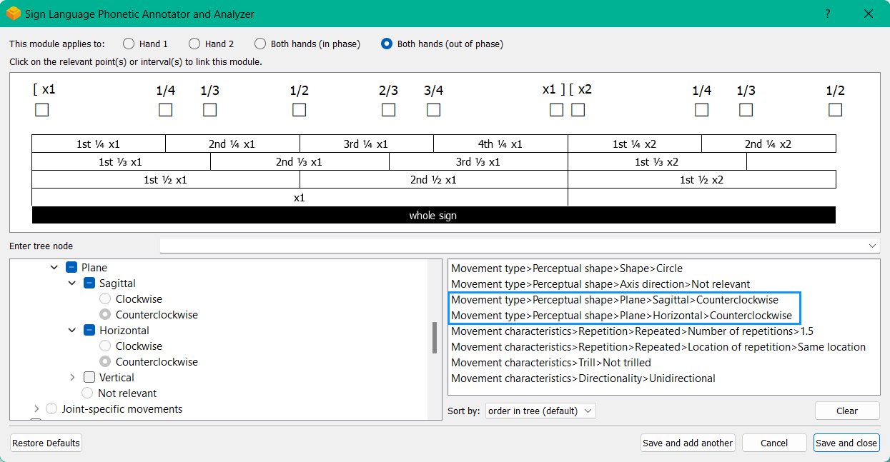

.. todo::
    angled plane example
    symmetry!!
    copy sign examples for plane/circular directionality
    replace current placeholders with diagrams
        - summary image
        - top of a circle/circular directions
        - multiple sets of axes superimposed on one image
        - multiple sets of planes superimposed on one image
    add references
        - Johnson & Liddell
        - (potentially) Battison
        - Canadian ASL dictionary?

.. comment:: 
    The documentations guidelines outline the information to be represented on this page as a general explanation of body geography, symmetry, planes, axes, the 'top' of a circle in each plane, anatomical position, and ipsi-contra definitions.

.. _signing_space_page:

***********************
Symmetry, Planes & Axes
***********************

This page will describe and define the terminology used throughout SLP-AA and here in its documentations in reference to the signing space on and surrounding the body. There is a fairly high level of complexity when dealing with motion in three-dimensional space, but our aim is that the visual and textual descriptions provided here will help to reduce any difficulty in interpreting the program's options and adapting them to the requirements of the individual user. 

The program relies on a system of axes and planes to frame three-dimensional space, and these are positioned relative to whichever arbitrary point makes the most sense for each sign component. This system is reapplied in several areas of the program, so many elements operate in the same way and knowing how to use one component will usually also help with being able to understand others.

.. note::
    SLP-AA incorporates the use of :ref:`modules<module>` to code sign aspects like :ref:`Hand Configuration<hand_configuration_module>`, :ref:`Location<location_module>`, :ref:`Movement<movement_module>`, :ref:`Orientation<orientation_module>`, and so on. For more discussion on the use of modules in SLP-AA to encode information about signs, see :ref:`modularity`.
    
    Module instances link to generic :ref:`x-slots<x_slot>` to record information about their timing relative to any others within a sign. For more information on the use of x-slots in SLP-AA, consult :ref:`timing_page`.

.. comment::
    Add links to handpart and contact when available.

.. _axes_entry:

1. Axes
````````

.. _axes_section:

I. Cardinal axis system
=======================

The system of axes is based on a set of three :ref:`cardinal_axes`: the **horizontal**, **vertical**, and **sagittal** axes. 

These axes can be described in reference to any given point on the signer's body or in the general signing space, depending on what is required for the situation. The vertical axis extends in a straight line up and down from a generic reference point, the horizontal extends to the left and right, and the sagittal axis extends forwards and backwards. These can be seen here, labelled with SLP-AA's :ref:`default direction settings<axis_default>`:

.. image:: images/shared_axes.png
    :width: 750
    :align: left

There is a good amount of flexibility in the program for users to decide on an interpretation of the axis system that suits their needs. The axes can be defined relative to the positioning of the signer's body or the direction that they're facing, or to a relevant part of the body, for example. The central point of origin can be adapted as necessary for the situation, as long as the cardinal axes are always oriented in the same way relative to each other.

.. image:: images/placeholder.png
    :width: 750
    :align: left

**(Multiple sets of axes superimposed to show that they can shift as needed - should be possible to duplicate the layers of axes over the image above and have them offset in different locations as long as this isn't too messy)**

.. _axis_directions:

II. Axis directions
===================

.. _axis_default:

a) Cardinal directions
~~~~~~~~~~~~~~~~~~~~~~

The pairs of endpoint directions for each axis are outlined here with sign examples involving a :ref:`perceptual_shape` traced out in the given direction. However, the axis system applies across modules, not just for movement. These examples are meant to clearly display what is meant by each direction label. See the note below for sign coding examples that apply this system to location and orientation as well.

Keep in mind that it is possible to select only the axis itself without a specific endpoint direction wherever a selection for an axis or direction applies in the program. The endpoints for the vertical and sagittal axes are consistent wherever they appear. 

* **Vertical axis**

    * **Up**, as in `UMBRELLA <https://asl-lex.org/visualization/?sign=umbrella>`_ or `NORTH <https://asl-lex.org/visualization/?sign=north>`_
    * **Down**, as in `LOSE_GAME <https://asl-lex.org/visualization/?sign=lose_game>`_ or `DRAW <https://asl-lex.org/visualization/?sign=draw>`_

* **Sagittal axis**

    * **Distal**, as in `NEXT <https://asl-lex.org/visualization/?sign=next>`_ or `SINCE <https://asl-lex.org/visualization/?sign=since>`_
    * **Proximal**, as in `BEFORE <https://asl-lex.org/visualization/?sign=before>`_ 
    
The directions for the horizontal axis, however, depend on the preferences of the user. These adhere to one of two models for the horizontal axis, either **relative** (:ref:`ipsilateral`/:ref:`contralateral`) or **absolute** (toward H1/H2). This is described in greater detail in :ref:`Symmetry<symmetry_section>` below. The horizontal axis options can be toggled separately for different modules; see the :ref:`global_settings` for how to change these options and to see which one applies by default for each module.
    
* **Horizontal axis: relative**

    * **Ipsilateral**, as in `SAUSAGE <https://asl-lex.org/visualization/?sign=sausage>`_
    * **Contralateral**, as in `GAME <https://asl-lex.org/visualization/?sign=game>`_ 

OR

* **Horizontal axis: absolute**
    
    * **Toward H1**, as in the right hand of `SAUSAGE <https://asl-lex.org/visualization/?sign=sausage>`_ or the left hand of `GAME <https://asl-lex.org/visualization/?sign=game>`_
    * **Toward H2**, as in the left hand of `SAUSAGE <https://asl-lex.org/visualization/?sign=sausage>`_ or the right hand of `GAME <https://asl-lex.org/visualization/?sign=game>`_

.. note::
    **Axis direction for location and orientation**
    
    Assuming that the horizontal axis is defined in relative (ipsi-contra) directions for all modules:
    
    * In `RAINBOW <https://asl-lex.org/visualization/?sign=rainbow>`_, the dominant hand moves in the ipsilateral *direction* (toward the signer's right, in this case), and it changes *location* within neutral space from the contralateral to the ipsilateral side of the body. The *orientation* of the hand changes in the production of the sign, starting with the finger roots pointing down and the palm facing the ipsilateral direction and finishing with the finger roots pointing up and the palm facing the contralateral direction.
    
    * In `SLICE_2 <https://asl-lex.org/visualization/?sign=slice_2>`_, the dominant hand moves in a proximal and ipsilateral *direction* (toward the signer's right, in this case), but its *location* starts in neutral space on the contralateral side and ends at the midline of the body without ever crossing over to the ipsilateral side. The *orientation* of the hand is unchanging, with the finger roots angled in the distal and contralateral directions and the palm angled to face the proximal and contralateral directions.
    
.. _angled_axes:

b) Angled axes
~~~~~~~~~~~~~~

Sometimes the axis direction of a perceptual shape is traced along an **angled path** rather than one of the :ref:`cardinal_axes`, as in `FOCUS <https://asl-lex.org/visualization/?sign=focus>`_ and `SNOW_2 <https://asl-lex.org/visualization/?sign=snow_2>`_. In this case, the angled path is made up of a combination of two or all three of the cardinal axes. See the following illustration for how this works:

.. image:: images/mov_combinations_of_axes.png
    :width: 750
    :align: left

In these examples, the sign includes the black line traced out in an angled direction. The angled line can be "flattened" into each of its component cardinal axes, and then the resulting axis directions are simpler to record and analyze. The information to record in the program for this example should then be the directions indicated for the coloured lines along each of their respective cardinal axes.

Here is a possible coding of `FOCUS <https://asl-lex.org/visualization/?sign=focus>`_, highlighting its two component axis directions within one module:

.. image:: images/mov_sample_sign_FOCUS.png
    :width: 750
    :align: left

This is also the case for other modules that use the axis system, as in angled orientations and locations (which may be described as displaced in more than one direction in comparison between two hands or from the beginning to the end of the sign production).

When multiple axes or directions are selected within one instance of a module, this is always interpreted as an angled axis with all selections applying simultaneously (according to the associated :ref:`timing values<timing_page>`). To instead indicate a sequence of directions, create multiple instances of the applicable module, associate them with separate (and sequential) :ref:`timing values<timing_page>`, and select the appropriate direction for each one.

.. comment::
    From the 'to mention' doc: It might be useful to give some examples of how our perceptual movement direction combination (e.g., up-ipsi, etc.) correspond to Johnson & Liddell’s (2021) vertical and horizontal “directions of bearing” (p.140-141, fig. 8-9). 

.. _planes_entry:

2. Planes
``````````

.. _planes_section:

I. Cardinal planes
==================

We can also describe a set of :ref:`cardinal_planes`, where each plane is formed by a pair of the :ref:`cardinal_axes` described above. These are the **horizontal**, **vertical**, and **sagittal** planes. The sagittal plane is formed by the sagittal and vertical axes (perpendicular to the horizontal axis). The horizontal plane is formed by the horizontal and sagittal axes (perpendicular to the vertical axis). The vertical plane is formed by the vertical and horizontal axes (perpendicular to the sagittal axis).

These are shown here:

.. image:: images/shared_planes.png
    :width: 750
    :align: left

As with the system of axes, the program is quite flexible so that users can decide on an interpretation of the plane system that suits their needs. The planes can be defined relative to the positioning of the signer's body or the direction that they're facing, or to a relevant part of the body, for example. The central point of origin can be adapted as necessary for the situation, as long as the cardinal planes are always oriented in the same way relative to each other.

.. image:: images/placeholder.png
    :width: 750
    :align: left

**(Multiple sets of planes superimposed to show that they can shift as needed)** 

**(the kind of information that can be recorded with only the 'axis direction' and 'plane' options, without circular directions.)** `WHALE <https://asl-lex.org/visualization/?sign=whale>`_

.. _angled_planes:

II. Angled planes
=================

Planes on an angle are made up of component combinations of two or all three of the cardinal planes. This is indicated in the module by selecting multiple planes at once within a single instance.

Here is a possible coding of `SIGN_EXAMPLE <>`_, highlighting its two component planes within one module:

.. image:: images/placeholder.png
    :width: 750
    :align: left

When multiple planes are selected within one instance of a module, this is always interpreted as an angled plane with all selections applying simultaneously (according to the associated :ref:`timing values<timing_page>`). To instead indicate a sequence where each plane applies separately, create multiple instances of the applicable module, associate them with separate (and sequential) :ref:`timing values<timing_page>`, and select the appropriate plane for each one.

.. _circular_directions:

III. Circular directions
========================

**Note that horizontal movements are dependent on the system for horizontal axis movements, so the choice for absolute or relative directions will have an impact here as well.** Introduce the concept of defining circular direction relative to (axis) direction through a single immutable point: in this case, our fixed reference point. the direction applies regardless of whether or not the hand actually travels through the top of the circle or not

**State the point on a circle in each plane that we define to be the top of a circle in that plane. Note especially that this notion is independent from movement. Then introduce the idea of circular directionality (in movement) as defined by the (axis) direction of movement through the topmost point for that plane. Needs a set of diagrams. Describe the sagittal plane, then horizontal, then vertical.**

.. image:: images/placeholder.png
    :width: 750
    :align: left

**(Insert image with circular directions for each plane.)**

.. _angled_circles:

IV. Angled circular directions
==============================

Sometimes circular shapes are traced within an **angled plane** rather than one of the :ref:`cardinal planes`, as in `SOCIALIZE <https://www.handspeak.com/word/index.php?id=2014>`_ and `TWIRL <https://asl-lex.org/visualization/?sign=twirl>`_. In this case, code the angled plane of movement by finding the applicable component planes (as described :ref:`above<angled_planes>`), and then continue to code the circular direction by selecting each of the component directions within their respective component (cardinal) planes. 

See the following illustration for how this works:

.. image:: images/mov_combinations_of_planes.png
    :width: 750
    :align: left

In this example, the sign includes the black circle traced out in an angled plane. The idea is that the angled circle could be "flattened" into each of its components, and then the resulting circular directions are simpler to record and analyze. Then the information to record in the program for this example should be each of the directionalities indicated for the coloured circles, which are situated in cardinal planes.

Here is a possible coding of a movement module for `SOCIALIZE <https://www.handspeak.com/word/index.php?id=2014>`_, highlighting the combined circular direction components:



When multiple directions are selected within one instance of a module, this is always interpreted as an angled direction with all selections applying simultaneously (according to the associated :ref:`timing values<timing_page>`). To instead indicate a sequence of directions, create multiple instances of the appropriate module, associate them with separate (and sequential) :ref:`timing values<timing_page>`, and select the appropriate direction for each one.

.. comment::
    **Relative orientation** using (linked?) Orientation and Location.
    
    Absolute vs. relative orientation of planes for `WASH_FACE_1 <https://asl-lex.org/visualization/?sign=wash_face_1>`_
    
    (This may be better to wait until the Orientation page is filled out a little more, as it may be better addressed there. I don't remember whether it's applicable at all here.)

.. _symmetry_section:

3. Symmetry
```````````

**What would be included here specifically?** — Body geography, more detail on symmetry across mid-sagittal plane/midline vs. other possible kinds of symmetry, justification for only focusing on this one kind. Ambiguity and confusion in defining "same" direction and location. Our setup is a choice of **prioritizing** one interpretation above the other in relevant contexts, not selecting only one and discarding the other completely. Interchangeability of the systems.

.. comment::
    Depending on definition, it could be equally valid that both hands located on the signer's dominant or subordinate side have the "same" location, or that both hands located on their own ipsilateral or contralateral side (relative to the midline of the body) have the "same" location. In order to remain explicit as to what this means and allow for precise analysis, SLP-AA allows for users to select whether the horizontal axis is defined for each module with **absolute** (toward H1 or H2 side) or **relative** (ipsi-contra) directions. For the absolute interpretation, the hands located together on the signer's dominant or subordinate side (such as `SINCE <https://asl-lex.org/visualization/?sign=since>`_) have the "same" location, and the hands mirrored across the midline (such as `ROW <https://asl-lex.org/visualization/?sign=row>`_) have different locations. For the relative interpretation, the hands mirrored across the midline have the "same" direction and the hands located on the signer's dominant or subordinate side have different locations.

.. comment::
    due to the natural bilateral symmetry of the human body. (It's possible that similar ambiguity could exist in either the vertical or sagittal axis in some cases, but we focus only on the horizontal axis since it has the benefit of a clear axis midpoint and grounding in physiology.)
    
.. note::
    **Left and right vs. H1 and H2 side**
    
    In some circumstances, the direction of movement is lexically encoded to be towards a side of the body independent of the signer's handedness. This is the case for `WEST <https://asl-lex.org/visualization/?sign=west>`_, where the direction of movement is towards the signer's left (regardless of the signer's dominant hand), and `EAST <https://asl-lex.org/visualization/?sign=east>`_, where the direction of movement is towards the signer's right. Both the absolute and relative models can describe the articulated movement in these signs, but neither one can capture the the full implications of the lexical definition as it applies across signers. This would require an additional note elsewhere in the sign coding.

.. _symmetry_review:

4. The signing space
````````````````````

**Detailed summary for quick reference, consisting mostly of a set of visuals and sign examples.**

**Include:** Quick and simple review of everything mentioned so far in terms of the basics of planes and axes, i.e. put these together with detailed illustrating images and just go for an overview of our cartesian system and the labels for each component. Focus on the competing options for describing horizontal symmetry. Hopefully this will be a good way to easily reference the important information without digging through the whole page.

.. image:: images/placeholder.png
    :width: 750
    :align: left

.. comment::
    This placeholder should be replaced with a detailed image that shows a full summary of the set of cardinal axes and planes with all possible directions labelled appropriately (including both sets of options for directions involving the horizontal axis), preferably with a demonstrated reference to the direction of the signer's body. This might be easiest to accomplish if we use a still image and superimpose the relevant information over top of it.

.. comment::
    {Introduction to the particular difficulties introduced with horizontal symmetry over any other kind}
    
    -->    {The (set of) sagittal plane(s) as normal to the horizontal axis}
        
    {Anatomical symmetry across the "midline," or whatever terminology}
    
    -->    Terminology: Line of bi-lateral symmetry (from Battison), or plane of horizontal symmetry, or plane of bisection, or other. Specifically the **mid-sagittal** plane, rather than any given sagittal plane. (i.e. symmetry in terms of actual physical symmetry)
    
    {Why the discrepancy? --> Difficulties in articulation mechanisms, anatomical limitations AND strengths}
    
    -->    Comment on low instances of simultaneous movement along sufficiently different axes and/or planes for each hand, and link this to difficulties wrapping our heads around complex combinations of movement in the mid-sagittal plane (the only one that does not involve the horizontal axis). Like trying to pat your head and rub your stomach, it takes more concentration and effort than moving in what we can easily conceptualize as the 'same' direction, with all of the baggage that that generalization comes along with. (Also link this to our broad categories in sign type for moving 'similarly' vs. 'differently' and how the 'simultaneous except handshape/location/orientation' options are more likely to apply with only minimal/predictable differences, e.g. simple alternation.) 
