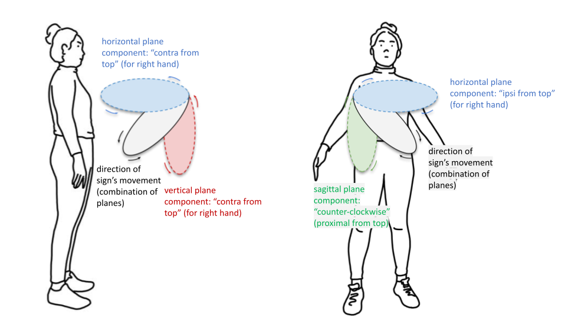

.. todo::
    (dynamic) direction and (static) location
    copy sign examples for each axis/direction, and plane/circular directionality
        - should be doubled from the movement docs and elsewhere
    replace current placeholders with diagrams
        - axis system
        - plane system, preferably
        - summary image
    references
        - Johnson & Liddell
        - (potentially) Battison

.. comment:: 
    The documentations guidelines outline the information to be represented on this page as a general explanation of body geography, symmetry, planes, axes, the 'top' of a circle in each plane, **anatomical position (?)**, and ipsi-contra definitions.
    
.. comment::
    From sign type: "Everything is mirrored / in phase" should be selected if location, handshape, and orientation are all mirrored / in phase (synchronized). Signs are considered to be mirrored / in phase when both hands have the same specification at the same time; signs are considered to be not mirrored / out of phase when the hands have opposite specifications at the same time; see :ref:`signing space<signing_space_page>` for more information.
    
.. comment::
    Note that we don't prescribe how the system of planes and axes must be defined in terms of their relation to the signer. There is freedom for an interpretation of relative planes both through the relative orientation system and because the set of planes need not be rigidly defined. (For example, if a signer changes position or moves part of their body in a different direction, the sign directions can apply as usual to the signer's altered position without any fuss.)

.. _signing_space_page:

***********************
Symmetry, Planes & Axes
***********************

**Introduction**

This page will describe the complexities of the three-dimensional signing space on and surrounding the body and explain the relevant terminology used throughout SLP-AA and here in its documentations.

.. note::
    Movement *direction* vs. static *location*. Use the left/right distinction relative to the intrinsic midline of the body. Grab a couple of sign examples to demonstrate. 
    
    Use the system overview to flag down every section where this will be relevant to think about, or otherwise just mention that it should be kept in mind for similar or identical descriptions used in differing contexts. Probably both.

.. _axes_entry:

1. Axes and straight movements
``````````````````````````````

**Introduction. Keep in mind that the system was altered so that an axis/axes can be selected without a direction.**

.. _axes_section:

I. Axes
=======

The system used in this program to describe location, direction of movement, orientation, ..., **(add references and links here to the specific parts of the program where this information is required and their associated documentations)**, depends on an understanding of the three ordinate axes: **horizontal**, **vertical**, and **mid-sagittal**.

Each axis can be described in reference to the signer's body. The vertical axis extends in a straight line up and down, the horizontal extends to the left and right, and the mid-sagittal axis extends forwards and backwards. These can be seen here:

.. image:: images/placeholder.png
    :width: 750
    :align: left

**This placeholder should be replaced with an image that shows the full system of cardinal axes relative to the signer's body.**

.. comment::
    .. _combinations_axes:
    
    a) Combinations of axes
    ~~~~~~~~~~~~~~~~~~~~~~~
    
    OR 
    
    (insert a note at this location in this section with the relevant information)

.. _axis_directions:

II. Axis directions
===================

**Introduction**

.. _axis_default:

a) Default directions
~~~~~~~~~~~~~~~~~~~~~

**Definition (and illustration) of the default directions along each axis.**

.. _axis_symmetry:

b) Symmetry in the horizontal axis
~~~~~~~~~~~~~~~~~~~~~~~~~~~~~~~~~~

**Complications from the horizontal axis in particular and any combinations involving it, the left/right system, interchangeability of the two horizontal systems, implications for 'same' direction in sign type**

[The issue with what horizontal symmetry even means: if the hands are moving towards each other, are they moving in the same direction? or if they're both moving to the signer's left, are they moving in the same direction? This is an issue with definition: the same in terms of what?]

.. note::
    From the 'to mention' doc: One example of where right-left rather than ipsi-contra distinction is useful, if not necessary, is indicating (referential?) signs, as described in Johnson & Liddell 2021 (p. 136-138). Maybe give this example?
    
    Resolved by giving examples of EAST and WEST? Reference J&L.

.. _angled_axes:

c) Directions in combinations of axes
~~~~~~~~~~~~~~~~~~~~~~~~~~~~~~~~~~~~~

An axis direction can also be specified to be angled by selecting multiple component directions from the applicable cardinal axes.

**How to approach combinations of axes. Mention again that these must be considered to be additive in a single module, not sequential.** (Use `FOCUS <https://asl-lex.org/visualization/?sign=focus>`_ and `SNOW_2 <https://asl-lex.org/visualization/?sign=snow_2>`_ as examples.)

.. image:: images/mov_sample_sign_FOCUS.png
    :width: 750
    :align: left

.. comment::
    From movement: Keep in mind that a single module is meant to convey only one direction of movement, so selecting a combination of axes should be interpreted as a diagonal or angled movement with all of the selected directions applying simultaneously. See the note on :ref:`combinations of axes<angled_axes>` for a visual description of how this works. For sequential movements along different axes, you should create multiple movement modules and use the :ref:`x-slot visualization window<sign_summary>` to assign a temporal order to the movement sequence.

.. note::
    From the 'to mention' doc: It might be useful to give some examples of how our perceptual movement direction combination (e.g., up-ipsi, etc.) correspond to Johnson & Liddell’s (2021) vertical and horizontal “directions of bearing” (p.140-141, fig. 8-9)

.. _planes_entry:

2. Planes and circular movements
````````````````````````````````

**Introduction**

.. _planes_section:

I. Planes
=========

.. warning::
    To be able to cover everything below the 'Planes' node, background information required includes: the basics of ipsi/contra and left/right; potentially a little in-depth discussion of normal vectors (though hopefully not strictly necessary here, and likely not in those words); basic knowledge of the axis directions applicable for both of the cardinal axes that form a basis for each plane; etc.
    
    Be sure that these are adequately covered above.

We can also describe a set of planes, where each one is formed by a pair of the cardinal axes described above...

These are the **horizontal**, **vertical**, and **mid-sagittal** planes. 

**(In this diagram, the signer would be facing toward the front side of the cube, looking out of the screen.)**

.. image:: images/shared_planes.png
    :width: 750
    :align: left

**Note: I made this image in a few minutes in a google doc, but it's not the best visual since the orientation of the planes relative to the signer is unclear this way. I would want something more like the image shown** `here <https://learnmuscles.com/glossary/cardinal-planes-of-the-body/>`_ **if we can manage that somehow.**

.. _angled_planes:

a) Combinations of planes
~~~~~~~~~~~~~~~~~~~~~~~~~

**Describe angled planes here for non-straight shapes without circular direction.** ... Planes on an angle are made up of component combinations of two or all three of the cardinal planes.

.. comment::
    From movement: Keep in mind that a single module is meant to convey only one direction of movement, so selecting a combination of planes should be interpreted as a diagonal or angled movement with all of the selected planes (and circular directions, if applicable) applying simultaneously. See the description of :ref:`combinations of planes<angled_planes>` and :ref:`angled circular directions<angled_circles>` for a visual description of how this works. For sequential movements in different planes, you should create multiple movement modules and use the :ref:`x-slot visualization window<sign_summary>` to assign a temporal order to the movement sequence.

.. _circular_directions:

II. Circular directions
=======================

**Introduction. Note that horizontal movements are dependent on the system for horizontal axis movements, so the choice for absolute or relative directions will have an impact here as well.** 

.. _top_of_circle:

a) 'Top' of a circle
~~~~~~~~~~~~~~~~~~~~

**State the point on a circle in each plane that we define to be the top of a circle in that plane. Note especially that this notion is independent from movement. Then introduce the idea of circular directionality (in movement) as defined by the (axis) direction of movement through the topmost point for that plane. Needs a set of diagrams. Follow the order as required in the next section: describe the mid-sagittal plane, then vertical, then horizontal.**

.. _plane_default:

b) Default directions
~~~~~~~~~~~~~~~~~~~~~

**Definition (and possibly illustration) of default directions, in reference to the top of the circle. Start with the mid-sagittal plane to describe the simple case, then the vertical, then horizontal.**

.. _plane_symmetry:

c) Symmetry in planes involving the horizontal axis
~~~~~~~~~~~~~~~~~~~~~~~~~~~~~~~~~~~~~~~~~~~~~~~~~~~

**Complications from the horizontal axis in particular, i.e. for the vertical and horizontal planes and any combinations involving these, the left/right system, interchangeability of the two horizontal systems, implications for 'same' direction in sign type.**

.. _angled_circles:

d) Circular shapes in combinations of planes
~~~~~~~~~~~~~~~~~~~~~~~~~~~~~~~~~~~~~~~~~~~~

Sometimes circular shapes are traced within an angled plane rather than one of the cardinal planes, as in `SOCIALIZE <https://www.handspeak.com/word/index.php?id=2014>`_ and `TWIRL <https://asl-lex.org/visualization/?sign=twirl>`_. In this case, code the orientation of the plane of movement by selecting the applicable component planes, as described :ref:`above<angled_planes>`, and code the direction within the angled plane by selecting the component directions within the component planes as well. See the following illustration for how this works:



In this example, the sign traces out the black circle in an angled plane. The information to record in the program is then the directionalities indicated for the red and blue circles, which are situated in cardinal planes. The idea is that the angled circle could be 'flattened' into its components, and then the resulting circular directions are simpler to record and analyze.

Here is an example of a possible coding for `SOCIALIZE <https://www.handspeak.com/word/index.php?id=2014>`_ for each hand:

.. image:: images/mov_sample_sign_SOCIALIZE_H1.png
    :width: 750
    :align: left

.. image:: images/mov_sample_sign_SOCIALIZE_H2.png
    :width: 750
    :align: left

Note that the axis direction as selected here describes the position of the hand at the midpoint of the first circle relative to its position at the beginning of the movement. (See the note on :ref:`axis direction for circular shapes<axis_direction_entry>` for more information).

.. _symmetry_review:

III. The signing space
======================

**Detailed summary for quick reference, consisting mostly of a set of visuals and sign examples.**

**Quick and simple review of everything mentioned so far in terms of the basics of planes and axes, i.e. put these together with detailed illustrating images and just go for an overview of our cartesian system and the labels for each component. Focus on the competing options for describing horizontal symmetry. Hopefully this will be a good way to easily reference the important information without digging through the whole page.**

.. image:: images/placeholder.png
    :width: 750
    :align: left

**This placeholder should be replaced with a detailed image that shows a full summary of the set of cardinal axes and planes with all possible directions labelled appropriately (including both sets of options for directions involving the horizontal axis), preferably with a demonstrated reference to the direction of the signer's body.**

.. _body_location_relative:

3. Body-anchored locations
``````````````````````````

**This section will describe how the information on the rest of this page applies to body-anchored locations in particular (rather than signing space locations, which are defined as relative to either the axis system or an item on the body location list). Important things to mention are that the system is not rigidly-defined in terms of the point of origin and orientation of the system of planes and axes relative to any particular point or direction, but it is important that the planes and axes are defined relative to each other. (It doesn't matter whether the signer turns to face a different direction, moves one part of the body, sits or lies down, etc.)**

.. _symmetry_puzzle:

4. The horizontal axis
``````````````````````

**Introduction. This section is all fun theory and brainbusters!** Note that this entire section is not strictly necessary to include and it can be deleted if it's confusing or in the way.

.. note::
    To include here:
    
    {Introduction to the particular difficulties introduced with horizontal symmetry over any other kind}
    
    -->    {The (set of) mid-sagittal plane(s) as normal to the horizontal axis}
        
    {Anatomical symmetry across the "midline," or whatever terminology}
    
    -->    Terminology: Line of bi-lateral symmetry (from Battison), or plane of horizontal symmetry, or plane of bisection, or other. Which one of these is the clearest/simplest? Is there a term used more often in sign language linguistics or sign language teaching? This cannot be referred to as the mid-sagittal plane, as it must specifically be horizontally central to the body (meanwhile a generic mid-sagittal plane can still be described to either side of the body, depending on the reference point of origin).
    
    {Why the discrepancy? Difficulties in articulation mechanisms}
    
    --> Comment on low instances of simultaneous movement along sufficiently different axes and/or planes for each hand, e.g. an axis on one hand AND a plane on the other. Link this to difficulties wrapping our heads around complex combinations of movement in the mid-sagittal plane. Like trying to pat your head and rub your stomach, it takes more concentration and effort than moving in what we can easily conceptualize as the 'same' direction, with all of the baggage that that generalization comes along with.
    
