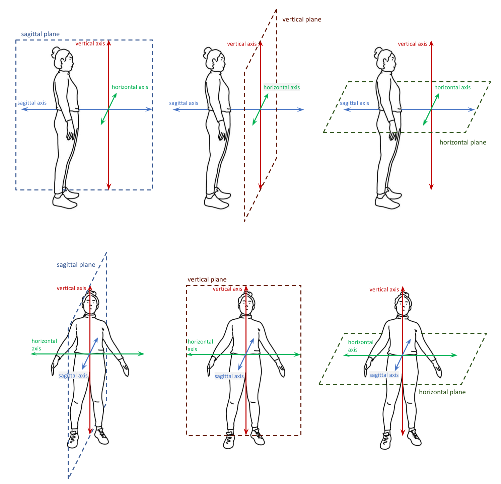

.. todo::
    symmetry!!
    replace current placeholders with diagrams
        - summary image
        - top of a circle/circular directions x3
        - multiple sets of axes superimposed on one image
        - multiple sets of planes superimposed on one image
    add references
        - Johnson & Liddell
        - (potentially) Battison
        - Canadian ASL dictionary?

.. comment:: 
    The documentations guidelines outline the information to be represented on this page as a general explanation of body geography, symmetry, planes, axes, the 'top' of a circle in each plane, anatomical position, and ipsi-contra definitions.

.. _signing_space_page:

***********************
Symmetry, Planes & Axes
***********************

This page will describe and define the terminology used throughout SLP-AA and here in its documentations in reference to the signing space on and surrounding the body. There is a fairly high level of complexity when dealing with motion in three-dimensional space, but our aim is that the visual and textual descriptions provided here will help to reduce any difficulty in interpreting the program's options and adapting them to the requirements of the individual user. 

The program relies on a system of axes and planes to frame three-dimensional space, and these are positioned relative to whichever arbitrary point makes the most sense for each sign component. This system is reapplied in several areas of the program, so many elements operate in the same way and knowing how to use one component will usually also help with being able to understand others.

.. note::
    SLP-AA incorporates the use of :ref:`modules<module>` to code sign aspects like :ref:`Hand Configuration<hand_configuration_module>`, :ref:`Location<location_module>`, :ref:`Movement<movement_module>`, :ref:`Orientation<orientation_module>`, and so on. For more discussion on the use of modules in SLP-AA to encode information about signs, see :ref:`modularity`.
    
    Module instances link to generic :ref:`x-slots<x_slot>` to record information about their timing relative to any others within a sign. For more information on the use of x-slots in SLP-AA, consult :ref:`timing_page`.

.. comment::
    Add links to handpart and contact when available.

.. _axes_entry:

1. Axes
````````

The primary spatial system used in SLP-AA is based on a set of three :ref:`cardinal_axes`: the **horizontal**, **vertical**, and **sagittal** axes.

These axes can be described in reference to any given point on the signer's body or in the general signing space, depending on what is required for the situation. The vertical axis extends in a straight line up and down from a generic reference point, the horizontal extends to the left and right, and the sagittal axis extends forwards and backwards. These can be seen here, labelled with SLP-AA's :ref:`default direction settings<axis_default>`:

.. image:: images/shared_axes.png
    :width: 750
    :align: left

There is a good amount of flexibility in the program for users to decide on an interpretation of the axis system that suits their needs. The axes can be defined relative to the positioning of the signer's body or the direction that they're facing, or to a relevant part of the body, for example. The central point of origin can be adapted as necessary for the situation, as long as the cardinal axes are always oriented in the same way relative to each other.

.. image:: images/placeholder.png
    :width: 750
    :align: left

**(Multiple sets of axes superimposed to show that they can shift as needed - should be possible to duplicate the layers of axes over the image above and have them offset in different locations as long as this isn't too messy)**

.. _axis_directions:

I. Axis directions
==================

.. _axis_default:

a) Cardinal axis directions
~~~~~~~~~~~~~~~~~~~~~~~~~~~

The pairs of endpoint directions for each axis are outlined here with sign examples involving a :ref:`perceptual_shape` traced out in the given direction. However, the axis system applies across modules, not just for movement. These examples are meant to clearly display what is meant by each direction label. See the note below for sign coding examples that apply this system to location and orientation as well.

Keep in mind that it is possible to select only the axis itself without a specific endpoint direction wherever a selection for an axis or direction applies in the program. The endpoints for the sagittal and vertical axes are consistent wherever they appear. 

* **Sagittal axis**

    * **Distal**, as in `NEXT <https://asl-lex.org/visualization/?sign=next>`_ or `SINCE <https://asl-lex.org/visualization/?sign=since>`_
    * **Proximal**, as in `BEFORE <https://asl-lex.org/visualization/?sign=before>`_ 

* **Vertical axis**

    * **Up**, as in `UMBRELLA <https://asl-lex.org/visualization/?sign=umbrella>`_ or `NORTH <https://asl-lex.org/visualization/?sign=north>`_
    * **Down**, as in `LOSE_GAME <https://asl-lex.org/visualization/?sign=lose_game>`_ or `DRAW <https://asl-lex.org/visualization/?sign=draw>`_

The directions for the horizontal axis, however, depend on the preferences of the user. These adhere to one of two models for the horizontal axis, either **relative** (:ref:`ipsilateral`/:ref:`contralateral`) or **absolute** (toward H1/H2). This is described in greater detail in :ref:`Symmetry<symmetry_section>` below. The horizontal axis options can be toggled separately for different modules; see the :ref:`global_settings` for how to change these options and to see which one applies by default for each module.
    
* **Horizontal axis: relative**

    * **Ipsilateral**, as in `SAUSAGE <https://asl-lex.org/visualization/?sign=sausage>`_
    * **Contralateral**, as in `GAME <https://asl-lex.org/visualization/?sign=game>`_ 

OR

* **Horizontal axis: absolute**
    
    * **Toward H1**, as in the right hand of `SAUSAGE <https://asl-lex.org/visualization/?sign=sausage>`_ or the left hand of `GAME <https://asl-lex.org/visualization/?sign=game>`_
    * **Toward H2**, as in the left hand of `SAUSAGE <https://asl-lex.org/visualization/?sign=sausage>`_ or the right hand of `GAME <https://asl-lex.org/visualization/?sign=game>`_

.. note::
    **Axis direction for location and orientation**
    
    Assuming that the horizontal axis is defined in relative (ipsi-contra) directions for all modules:
    
    * In `RAINBOW <https://asl-lex.org/visualization/?sign=rainbow>`_, the dominant hand moves in the ipsilateral *direction* (toward the signer's right, in this case), and it changes *location* within neutral space from the contralateral to the ipsilateral side of the body. The *orientation* of the hand changes in the production of the sign, starting with the finger roots pointing down and the palm facing the ipsilateral direction and finishing with the finger roots pointing up and the palm facing the contralateral direction.
    
    * In `SLICE_2 <https://asl-lex.org/visualization/?sign=slice_2>`_, the dominant hand moves in a proximal and ipsilateral *direction* (toward the signer's right, in this case), but its *location* starts in neutral space on the contralateral side and ends at the midline of the body without ever crossing over to the ipsilateral side. The *orientation* of the hand is unchanging, with the finger roots angled in the distal and contralateral directions and the palm angled to face the proximal and contralateral directions.
    
.. _angled_axes:

b) Angled axes
~~~~~~~~~~~~~~

Sometimes the axis direction of a perceptual shape is traced along an **angled path** rather than one of the :ref:`cardinal_axes`, as in `FOCUS <https://asl-lex.org/visualization/?sign=focus>`_ and `SNOW_2 <https://asl-lex.org/visualization/?sign=snow_2>`_. In this case, the angled path is made up of a combination of two or all three of the cardinal axes. See the following illustration for how this works:

.. image:: images/mov_combinations_of_axes.png
    :width: 750
    :align: left

In these examples, the sign includes the black line traced out in an angled direction. The angled line can be "flattened" into each of its component cardinal axes, and then the resulting axis directions are simpler to record and analyze. The information to record in the program for this example should then be the directions indicated for the coloured lines along each of their respective cardinal axes.

Here is a possible coding of `FOCUS <https://asl-lex.org/visualization/?sign=focus>`_, highlighting its two component axis directions within one module:

.. image:: images/mov_sample_sign_FOCUS.png
    :width: 750
    :align: left

This is also the case for other modules that use the axis system, as in angled orientations and locations (which may be described as displaced in more than one direction in comparison between two hands or from the beginning to the end of the sign production).

When multiple axes or directions are selected within one instance of a module, this is always interpreted as an angled axis with all selections applying simultaneously (according to the associated :ref:`timing values<timing_page>`). To instead indicate a sequence of directions, create multiple instances of the applicable module, associate them with separate (and sequential) :ref:`timing values<timing_page>`, and select the appropriate direction for each one.

.. warning::
    **(For Kathleen and Oksana)**
    
    From the 'to mention' doc: It might be useful to give some examples of how our perceptual movement direction combination (e.g., up-ipsi, etc.) correspond to Johnson & Liddell’s (2021) vertical and horizontal “directions of bearing” (p.140-141, fig. 8-9). 

.. _planes_entry:

2. Planes
``````````

We can also describe a set of :ref:`cardinal_planes`, where each plane is formed by a pair of the :ref:`cardinal_axes` described above. These are the **horizontal**, **vertical**, and **sagittal** planes. Each plane is perpendicular to the other two.

The sagittal plane is formed by the sagittal and vertical axes. The horizontal plane is formed by the horizontal and sagittal axes. The vertical plane is formed by the vertical and horizontal axes. These are shown here:



As with the system of axes, the program is quite flexible so that users can decide on an interpretation of the plane system that suits their needs. The planes can be defined relative to the positioning of the signer's body or the direction that they're facing, or to a relevant part of the body, for example. The set of cardinal planes are not fixed in space, and they can move as necessary as long as the planes are always oriented in the same way relative to each other and to the system of cardinal axes as applied for the same circumstance.

.. image:: images/placeholder.png
    :width: 750
    :align: left

**(Multiple sets of planes superimposed to show that they can shift as needed)** 

.. note::
    **Angled planes**
    
    Planes on an angle are made up of component combinations of two or all three of the cardinal planes. This is indicated in the module by selecting multiple planes at once within a single instance.
    
    Also see the section on :ref:`Angled circular directions<angled_circles>` below, which includes a sample coding involving an angled plane.
    
    When multiple planes are selected within one instance of a module, this is always interpreted as an angled plane with all selections applying simultaneously (according to the associated :ref:`timing values<timing_page>`). To instead indicate a sequence where each plane applies separately, create multiple instances of the applicable module, associate them with separate (and sequential) :ref:`timing values<timing_page>`, and select the appropriate plane for each one.

.. _circular_directions:

I. Circular (non-straight) directions
======================

Within each plane, signs involving a non-straight :ref:`perceptual_shape` (e.g., circles, arcs, 7, etc.) can be traced out in one of two circular directions. Unlike the :ref:`Axis direction<axis_directions>` options, this section applies only to the :ref:`movement_module`, as it is only relevant for describing motion.

.. _circular_definitions:

a) Defining circular direction
~~~~~~~~~~~~~~~~~~~~~~~~~~~~~~

Note that this section applies to any :ref:`perceptual_shape` sign other than *straight*. (For a *straight* perceptual shape sign, circular direction is automatically selected by the program as *not relevant*.)

Rather than defining formal definitions of which direction is meant to be 'clockwise' or 'counter-clockwise' for each plane, which is not always memorable or intuitive and can be difficult to keep track of through changing perspectives (and also may not apply consistently depending on whether a signer is right- or left-handed), the system for circular direction in SLP-AA is built directly on the system for :ref:`Axis direction<axis_directions>`. 

We define a point to be the **top of a circle** for any given circular shape in each of the three :ref:`cardinal_planes`, and then the circular direction follows based on the axis direction of the hand as it moves through that point. If the hand does not reach the top of the circle in a particular sign,  the direction should still be defined based on how the hand **would** move through the top point if it continued in the same direction. It also should not matter where the hand happens to start making the circle; the definition of the circle is defined by where the hand moves from the top (whenever it happens to get there). 

Consider the sagittal plane. This is easily conceptualized to have a 'top' point of a circle at the highest (or most **up**) point. While the hand sits at the top of the circle, it can move within the plane away from the speaker in the distal direction or toward the speaker in the proximal direction before continuing to complete the circular shape. 

The set of options for circular directions in the sagittal plane are:

* **Proximal from the top of the circle**, as in `BACK_UP <https://asl-lex.org/visualization/?sign=back_up>`_ or `ROW <https://asl-lex.org/visualization/?sign=row>`_
* **Distal from the top of the circle**, as in `BICYCLE <https://asl-lex.org/visualization/?sign=bicycle>`_ or `REASON <https://www.handspeak.com/word/index.php?id=3974>`_

.. image:: images/placeholder.png
    :width: 750
    :align: left

**(Single image for sagittal plane only, clearly indicating the top of the circle and the two circular directions. This should be shown relative to the speaker's body.)**

Since this system is based on axis direction, the distinction between the **relative** (:ref:`ipsilateral`/:ref:`contralateral`) and **absolute** (toward H1/H2) models for the horizontal axis applies here as well, and it will affect the vertical and horizontal planes. These models are described in greater detail in :ref:`Symmetry<symmetry_section>` below. The set of options for circular direction will correspond to your choices for the :ref:`movement_module` as set in the :ref:`global_settings`, which means that the relative set of options applies by default unless you choose to change it.

The vertical plane similarly has a clear 'top' point of a circle at the highest (or most **up**) point. While the hand sits at the top of the circle, it can move within the plane to one horizontal side or the other. The dominant hand, for instance, can move in the ipsilateral direction/toward the H1 side or in the contralateral direction/toward the H2 side before continuing to complete the circular shape. 

The set of options for circular directions in the vertical plane are:

Relative [Default]

* **Ipsilateral from the top of the circle**, as in `RAINBOW <https://asl-lex.org/visualization/?sign=rainbow>`_
* **Contralateral from the top of the circle**, as in `ENJOY <https://asl-lex.org/visualization/?sign=enjoy>`_

OR

Absolute

* **Toward H1 side from the top of the circle**, as in `RAINBOW <https://asl-lex.org/visualization/?sign=rainbow>`_ or the left hand of `ENJOY <https://asl-lex.org/visualization/?sign=enjoy>`_
* **Toward H2 side from the top of the circle**, as in the right hand of `ENJOY <https://asl-lex.org/visualization/?sign=enjoy>`_

.. image:: images/placeholder.png
    :width: 750
    :align: left

**(Single image for vertical plane only, clearly indicating the top of the circle and the two circular directions. This should be shown relative to the speaker's body.)**

The horizontal plane does not have a clear point that would be considered the 'top' of a circle, so we define it to be the point that is furthest away from the speaker (or the most **distal** point). When the hand sits at that point, it can also move to either side in a horizontal direction. This means that the same set of circular directions applies for the horizontal plane as for the vertical. 

The set of options for circular directions in the horizontal plane are:

Relative [Default]

* **Ipsilateral from the top of the circle**, as in `SWIM <https://asl-lex.org/visualization/?sign=swim>`_ or the left hand of `DECORATE_2 <https://asl-lex.org/visualization/?sign=decorate_2>`_
* **Contralateral from the top of the circle**, as in `CELEBRATE <https://asl-lex.org/visualization/?sign=celebrate>`_ or the right hand of `DECORATE_2 <https://asl-lex.org/visualization/?sign=decorate_2>`_

OR

Absolute

* **Toward H1 side from the top of the circle**, as in the left hand of `CELEBRATE <https://asl-lex.org/visualization/?sign=celebrate>`_ 
* **Toward H2 side from the top of the circle**, as in `DECORATE_2 <https://asl-lex.org/visualization/?sign=decorate_2>`_ or the right hand of `CELEBRATE <https://asl-lex.org/visualization/?sign=celebrate>`_

.. image:: images/placeholder.png
    :width: 750
    :align: left

**(Single image for horizontal plane only, clearly indicating the top of the circle and the two circular directions. This should be shown relative to the speaker's body.)**

.. note::
    **Circular shapes that don't pass through the top of the circle**
    
    Circular perceptual shapes can travel at least one full circuit of a circular path, as in `BICYCLE <https://asl-lex.org/visualization/?sign=bicycle>`_, or they can travel a smaller section of the circle, as in `SHOVEL <https://asl-lex.org/visualization/?sign=shovel>`_ or `RAINBOW <https://asl-lex.org/visualization/?sign=rainbow>`_. Even if the hand does not ever reach the point defined as the top of the circle in that plane, the circular direction of the movement is defined in terms of how the hand *would* pass through that point, if it continued on its path. 
    
    This means that both `SHOVEL <https://asl-lex.org/visualization/?sign=shovel>`_ and `RAINBOW <https://asl-lex.org/visualization/?sign=rainbow>`_ would be coded as moving *toward H1 from the top of the circle*, even though only one of these signs actually passes through the top of the circle.

.. _angled_circles:

b) Angled circular directions
~~~~~~~~~~~~~~~~~~~~~~~~~~~~~

Sometimes circular shapes are traced within an **angled plane** rather than one of the :ref:`cardinal planes`, as in `SOCIALIZE <https://www.handspeak.com/word/index.php?id=2014>`_ and `TWIRL <https://asl-lex.org/visualization/?sign=twirl>`_. In this case, code the angled plane of movement by finding the applicable component planes (as described in :ref:`Angled planes<angled_planes>` above), and then continue to code the circular direction by selecting each of the component directions within their respective component (cardinal) planes. 

See the following illustration for how this works:

.. image:: images/mov_combinations_of_planes.png
    :width: 750
    :align: left

In this example, the sign includes the black circle traced out in an angled plane. The idea is that the angled circle could be "flattened" into each of its components, and then the resulting circular directions are simpler to record and analyze. Then the information to record in the program for this example should be each of the directionalities indicated for the coloured circles, which are situated in cardinal planes.

Here is a possible coding of a movement module for `SOCIALIZE <https://www.handspeak.com/word/index.php?id=2014>`_, highlighting the combined circular direction components:

.. image:: images/mov_sample_sign_SOCIALIZE.png
    :width: 750
    :align: left

When multiple directions are selected within one instance of a module, this is always interpreted as an angled direction with all selections applying simultaneously (according to the associated :ref:`timing values<timing_page>`). To instead indicate a sequence of directions, create multiple instances of the appropriate module, associate them with separate (and sequential) :ref:`timing values<timing_page>`, and select the appropriate direction for each one.

.. comment::
    **Relative orientation** using (linked?) Orientation and Location.
    
    Absolute vs. relative orientation of planes for `WASH_FACE_1 <https://asl-lex.org/visualization/?sign=wash_face_1>`_
    
    (This may be better to wait until the Orientation page is filled out a little more, as it may be better addressed there. I don't remember whether it's applicable at all here.)

.. _symmetry_section:

3. Symmetry
```````````

SLP-AA uses two interchangeable systems for interpreting horizontal symmetry, which apply to any specifications that involve the horizontal axis. This is the horizontal axis itself for :ref:`Axis directions<axis_directions>` and the vertical and horizontal planes for :ref:`Circular directions<circular_directions>`—all other cardinal axes and planes lie perpendicular to the horizontal axis.

...

There is no articulatory difference, for instance, between the dominant hand moving to the H1 side or in the ipsilateral direction. These systems are only superficially different, and the information coded in each one can be recovered from the other. The biggest differences between using one or the other pertain to the :ref:`sign_type_module` options. Since the options are interchangeable, the choice is only a matter of user preference.

.. note::
    **Exclusion of other kinds of symmetry**
    
    Though there may be noteworthy information to focus on for other kinds of symmetry, we have only incorporated consideration for one particular kind of symmetry into the design of the program due to the natural bilateral symmetry of the human body. For instance, we don't know of any signs that involve both hands moving in opposite :ref:`circular directions<circular_directions>` in the sagittal plane (as this is articulatorily very difficult), but there are many signs that involve the hands moving in opposite circular directions in the vertical and horizontal plane.
    
    **(this is not in polished form, but I also want to work in terminology for the mid-saggital plane either here or above, which may benefit from a glossary entry)**

.. warning::
    **(My notes for this section)**
    
    * define what these systems are
    
        * independent for each module
        * equal, interchangeable, retrievable from each other
            
            * i.e. this is primarily a difference of NOTATION, but it can be changed to better align with whichever phonological conception you subscribe to
            
        * link to the global settings
    
    * explain that they are both accurate, but the choice involves prioritizing one kind of interpretation over the other
    
        * this is to reduce ambiguity and allow for explicit and rigorous definitions of sign type especially
        * selecting one interpretation does not mean discarding the other
        
    * point out parts of the program that rely on these interpretations, and should be interacted with differently depending on the choice
    
        * phasing? currently sign type has the note on phasing and symmetry
        * anything that mentions the "same" or "different" direction, location, orientation, etc.

.. comment::
    {Introduction to the particular difficulties introduced with horizontal symmetry over any other kind}
    
    →    {The (set of) sagittal plane(s) as normal to the horizontal axis}
        
    {Anatomical symmetry across the "midline," or whatever terminology}
    
    →    Terminology: Line of bi-lateral symmetry (from Battison), or plane of horizontal symmetry (more consistent with our system and faithful to a 3D conception of the signing space), or plane of bisection, or other. Specifically the **mid-sagittal** plane, rather than any given sagittal plane. (i.e. symmetry in terms of actual physical symmetry)
    
    {Why the discrepancy? --> Difficulties in articulation mechanisms, anatomical limitations AND strengths}
    
    →    Comment on low instances of simultaneous movement along sufficiently different axes and/or planes for each hand, and link this to difficulties wrapping our heads around complex combinations of movement in the mid-sagittal plane (the only one that does not involve the horizontal axis). Like trying to pat your head and rub your stomach, it takes more concentration and effort than moving in what we can easily conceptualize as the 'same' direction, with all of the baggage that that generalization comes along with. (Also link this to our broad categories in sign type for moving 'similarly' vs. 'differently' and how the 'simultaneous except handshape/location/orientation' options are more likely to apply with only minimal/predictable differences, e.g. simple alternation.)

.. warning::
    **(Under construction)**
    
    Depending on definition, it could be equally valid that both hands moving to signer's dominant or subordinate side are moving in the "same" direction, or that both hands moving towards or away from each other (and also usually towards or away from the midline of the body) are moving in the "same" direction. In order to remain explicit as to what this means and allow for precise analysis, SLP-AA allows for users to select whether the horizontal axis is displayed with **absolute** (toward H1 or H2 side) or **relative** (ipsi-contra) options for each module. For the absolute interpretation, the hands moving towards or away from the signer's dominant side are moving in the "same" direction and the hands moving towards or away from each other are moving in different directions. For the relative interpretation, the hands moving towards or away from each other are moving in the "same" direction and the hands moving towards or away from the signer's dominant side are moving in different directions. These options can be changed in the :ref:`global_settings`.

.. comment::
        Depending on definition, it could be equally valid that both hands located on the signer's dominant or subordinate side have the "same" location, or that both hands located on their own ipsilateral or contralateral side (relative to the midline of the body) have the "same" location. In order to remain explicit as to what this means and allow for precise analysis, SLP-AA allows for users to select whether the horizontal axis is defined for each module with **absolute** (toward H1 or H2 side) or **relative** (ipsi-contra) directions. For the absolute interpretation, the hands located together on the signer's dominant or subordinate side (such as `SINCE <https://asl-lex.org/visualization/?sign=since>`_) have the "same" location, and the hands mirrored across the midline (such as `ROW <https://asl-lex.org/visualization/?sign=row>`_) have different locations. For the relative interpretation, the hands mirrored across the midline have the "same" direction and the hands located on the signer's dominant or subordinate side have different locations.

.. warning::
    **(For Kathleen and Oksana)** - relevant to the note below
    
    From the 'to mention' doc: One example of where right-left rather than ipsi-contra distinction is useful, if not necessary, is indicating (referential?) signs, as described in Johnson & Liddell 2021 (p. 136-138). Maybe give this example?
    
    Resolved by giving examples of EAST and WEST? Reference J&L.
    
    (We don't use right and left for the absolute directions anymore, but the reference could still be helpful - Nico)

.. note::
    **Left and right vs. H1 and H2 side**
    
    In some circumstances, the direction of movement is lexically encoded to be towards a side of the body independent of the signer's handedness. This is the case for `WEST <https://asl-lex.org/visualization/?sign=west>`_, where the direction of movement is towards the signer's left (regardless of the signer's dominant hand), and `EAST <https://asl-lex.org/visualization/?sign=east>`_, where the direction of movement is towards the signer's right. 
    
    Both of the models for the horizontal axis used in SLP-AA can describe the articulated movement in these (and any other) signs, but neither one can capture the the full implications of the lexical definition using only the phonetic descriptors available in the :ref:`movement_module`. For signs like this, it may be helpful to indicate the definition elsewhere in the sign coding.

.. _symmetry_review:

4. The signing space
````````````````````

**Detailed summary for quick reference, consisting mostly of a set of visuals and sign examples.**

**Include:** Quick and simple review of everything mentioned so far in terms of the basics of planes and axes, i.e. put these together with detailed illustrating images and just go for an overview of our cartesian system and the labels for each component. Focus on the competing options for describing horizontal symmetry. Hopefully this will be a good way to easily reference the important information without digging through the whole page.

.. image:: images/placeholder.png
    :width: 750
    :align: left

.. warning::
    This placeholder should be replaced with a detailed image (or set of images) that shows a full summary of the set of cardinal axes and planes with all possible directions labelled appropriately, including both sets of options for directions involving the horizontal axis. This would preferably be shown with a demonstrated reference to the direction of the signer's body.

